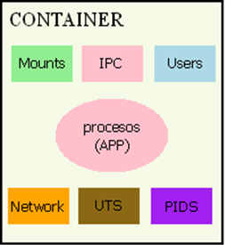
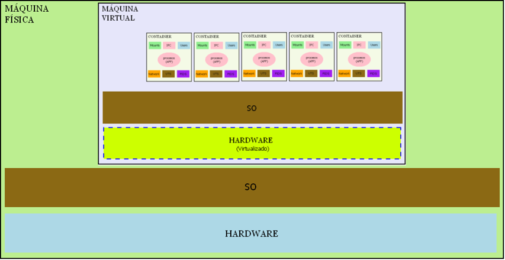
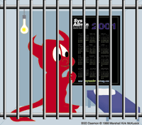
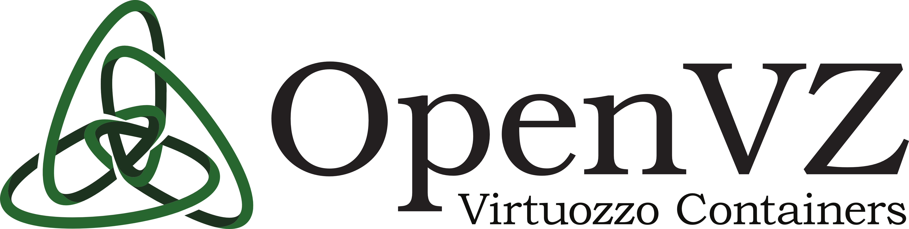
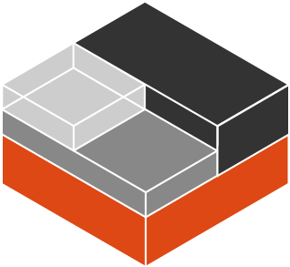
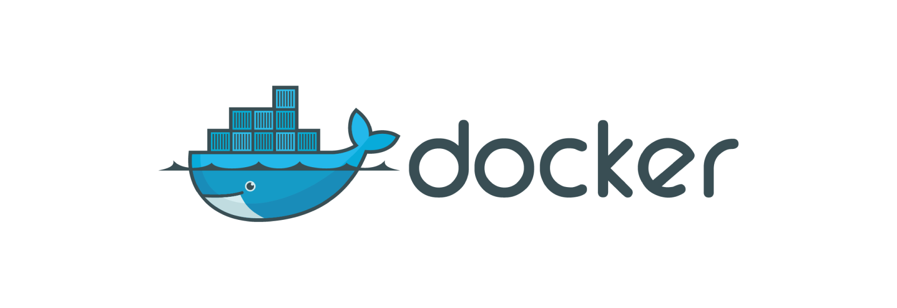

# Pero, ¿qué es un contenedor?

> Un contenedor es una [técnica de virtualización a nivel de sistema operativo](https://es.wikipedia.org/wiki/Virtualizaci%C3%B3n_a_nivel_de_sistema_operativo) que aísla un proceso, o grupo de procesos, proporcionándoles un contexto de ejecución "completo". ". Si entiendo por contexto, o entorno de ejecución, el conjunto de recursos (PIDs, red, sockets, puntos de montaje...) que son relevantes para el proceso.

Dentro del mundo Linux, que es el tipo de contenedores con los que vamos a trabajar, un contenedor se basa en las tecnologías de namespaces y cgroups, los docks permiten "separar" los procesos que corren dentro del contenedor, del resto de el sistema.


A medio camino entre chroot y las soluciones de virtualización completa (KVM, VirtualBox, VMWare, Xen), el contenedor no incurre en el costo de virtualizar el hardware o el kernel del sistema operativo y aún ofrece un nivel mucho más alto de control y aislamiento para el chroot.

El contenedor es mucho más rápido de aprovisionar que la máquina virtual (VM), no necesita arrancar una emulación de dispositivo o el kernel del sistema operativo, a costa de un menor nivel de aislamiento: los procesos en diferentes contenedores comparten el mismo kernel.
## Espacios de nombres

Los contenedores de software consisten en una técnica de virtualización a nivel de sistema operativo, también conocida como virtualización a nivel de proceso.

La idea es simple, ya que el SO es, desde el punto de vista del proceso, un conjunto de recursos, podemos darle una vista "privada" o virtual de esos recursos.



Virtualizar esos recursos globales de tal manera que, desde el punto de vista del proceso, le sean privados, **de eso se trata un contenedor**.

> "Al igual que en la virtualización a nivel de plataforma, el sistema operativo "cree" que se está ejecutando en una máquina real, en la creación de contenedores, el proceso "cree" que tiene un sistema operativo para sí mismo"

La técnica de usar contenedores es superior a la virtualización de plataformas en que:

- No supone un coste de recursos adicionales por tener que emular hardware y ejecutar un SO en él: puedes tener miles de contenedores en un servidor.
- El inicio/parada de un contenedor es prácticamente el mismo que el inicio/parada de un proceso (< 1'').

A expensas de:

- Comparte el kernel del sistema operativo.

Además, no es una alternativa a la técnica de virtualización de plataformas: por el contrario, es **totalmente compatible**. Precisamente, así se está utilizando en muchos sitios:



**Σ Webografía**
- Kerrisk Michael, "**Espacios de nombres en funcionamiento, parte 1: descripción general de los espacios de nombres**" [en línea]. Disponible: [enlace](https://lwn.net/Articles/531114/) [Consulta: 06-Enero-2019]
 - El primero de 9 artículos a consultar para una exploración en profundidad de los espacios de nombres en Linux y su estado como elemento fundamental para los contenedores.
 ## CGroups

Sabemos que el trabajo del Kernel de Linux es evitar que los procesos acaparen recursos básicos como:

- CPU
- Memoria
- Operaciones de E/S

La pregunta que surge es: ¿permite un control minucioso del acceso y consumo de estos recursos?

La respuesta es que, antes de la versión 2.6.24, había mecanismos de control (principalmente el comando [nice](https://linux.die.net/man/1/nice)) pero eran muy limitados.

Todo esto cambia con la adopción en enero de 2008 por parte del kernel de Linux de [control groups](https://wiki.archlinux.org/index.php/cgroups) (cgroups para abreviar) impulsados ​​principalmente por ingenieros de Google.

cgroups puede verse como un árbol en el que los procesos se cuelgan de un poste de control de tal manera que se pueden establecer, para ese proceso y sus hijos:

- Limitaciones de recursos.
- Prioridades de acceso a los recursos.
- Seguimiento del uso de los recursos.
- Gestión de procesos a bajo nivel.

La flexibilidad que permiten es muy grande. Se pueden crear diferentes grupos de restricciones y controles y se puede asignar un proceso y sus hijos a diferentes grupos, haciendo combinaciones que permiten un alto grado de personalización.


## Evolución de las tecnologías de contenedores

> Vamos a repasar una serie de herramientas y tecnologías que han ido surgiendo a lo largo de los años en diferentes sistemas operativos, para dar respuesta al problema planteado en el módulo 1 de Docker sobre la gestión de recursos dentro de un SO.

---
### **Jaulas Chroot (1979)**


En el desarrollo del sistema Unix V7, se agregó una nueva llamada al sistema (chroot) que permitía cambiar el directorio raíz de un proceso y sus descendientes a una nueva ubicación en el sistema de archivos.

Este avance fue el comienzo del aislamiento a nivel de proceso, lo que hizo posible controlar el acceso a los archivos por proceso.

Actualmente esa herramienta sigue estando disponible en cualquier sistema Unix, y por supuesto en Linux. Puedes probarlo siguiendo el siguiente ejemplo:

```shell
# copiamos los binarios que queremos executar na xaula chroot
mkdir -p chroot/bin
sudo cp /bin/{ls,bash,mkdir,rm} chroot/bin/
sudo cp /usr/bin/tree chroot/bin/
```

```shell
# montamos librerias
mkdir chroot/{lib,lib64}
for i in {lib,lib64}; do sudo mount --bind /$i chroot/$i ; done
```

```shell
# chroot
sudo chroot chroot/
```

```shell
# probamos a executar estos comandos básicos de unix
ls
tree -d -L 2
mkdir /probando
```

```shell
# desmontamos
for i in {lib,lib64}; do sudo umount chroot/$i ; done
```

---

### **FreeBSD Jails (2000), Solaris Zones (2004)**




Dos décadas después, un proveedor de hosting lanzó un servicio sobre jaulas BSD para lograr una clara separación de recursos entre sus servicios y los de sus clientes, y de esta forma mejorar la seguridad y facilitar la administración de los mismos.

Las jaulas de FreeBSD permiten a un administrador particionar un sistema FreeBSD en varios sistemas BSD independientes con menos recursos, aislados y con la capacidad de agregar una IP a cada uno de ellos.

Oracle ha agregado una función similar a Solaris, que combina el control de los recursos que puede consumir un proceso con la zonificación de los procesos que se ejecutan en la máquina.

---

### **OpenVZ (2005)**



Un año después, la empresa Virtuozzo creó un nuevo sistema de virtualización basado en contenedores, sobre el kernel de Linux, que permitía crear múltiples contenedores aislados y seguros en una misma máquina, como si de un servidor privado virtual se tratase.

El código OpenVZ, aunque de código abierto, nunca ha sido parte de la distribución oficial del kernel de Linux y se incorpora como una serie de parches adicionales que se aplican sobre el código del kernel.

---

### **linuxcontainers (2008) y Docker (2013)**




La primera herramienta de contenedores de software que encontró una amplia aceptación dentro de la comunidad de Linux fue [LXC](https://linuxcontainers.org/), principalmente debido a las tecnologías que reunió y que se introdujeron en el kernel de Linux (**Namespaces y cgroups**).

Su objetivo es tener un contenedor como entorno lo más similar posible a una máquina virtual, pero sin la sobrecarga de emular hardware.

La gestión de este contenedor se realiza a través de una serie de archivos de configuración, donde el usuario tiene que descargar y preparar el sistema de archivos, y definir y configurar los namespaces donde quiere conectarse al contenedor, conectarse a la red... lo que lo convierte en una herramienta muy hostil para un desarrollador.

La empresa dotCloud, donde trabajaron los creadores de Docker, y que utilizó LXC para brindar a sus clientes uno de los primeros [servicios de hosting PaaS](https://azure.microsoft.com/es-es/overview/what-is-paas/) que apareció en el mercado, buscando la forma de facilitar la adopción de su servicio, y tratando de hacer más accesible la tecnología de contenedores a los desarrolladores de aplicaciones, creó el proyecto que sería el precursor de Docker.

Docker se lanza como un proyecto [de código abierto](https://github.com/moby/moby) el 13 de marzo de 2013 y hoy, a pesar del cambio de estrategia y nombre, tiene más de 50 000 estrellas en Github y casi 2000 colaboradores, y se ha convertido en la tecnología líder para la gestión de contenedores.

* **Aprende más**

   - [A brief history of containers](https://blog.aquasec.com/a-brief-history-of-containers-from-1970s-chroot-to-docker-2016)

   - [Confining the omnipotent root](http://phk.freebsd.dk/pubs/sane2000-jail.pdf)
