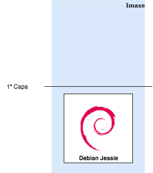
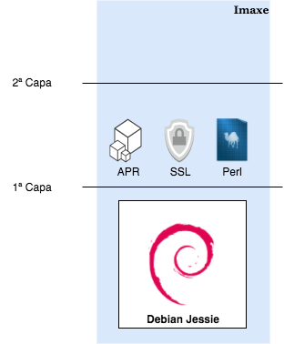
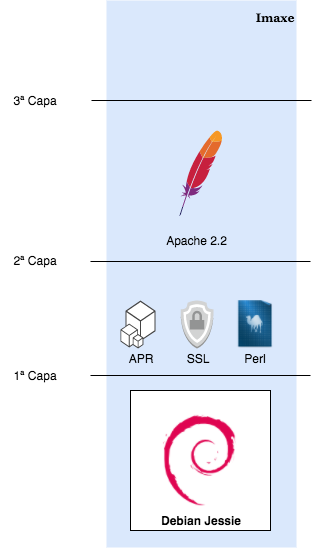
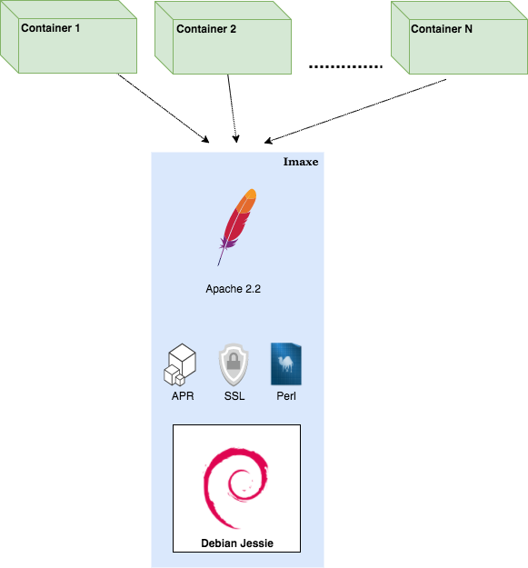
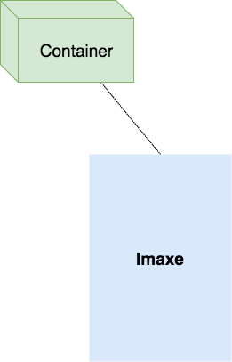

# Docker: contedores para todos

> Docker, a pesar da sua curta vida como proxecto de software aberto, está a producir unha revolución no sector das tecnoloxías da información.

**De xeito similar a revolución que supoxo a adopción dos contedores de mercancías, ao estandarizar as características das caixas nas que se transportan e moven por todo o mundo todo tipo de materias,  o que permiten adaptar e optimizar as infraestructuras polas que se almacenan e desprazan, Docker estandariza o proceso de transporte de software.**

Dende o punto de vista dun administrador de sistemas, nos permite cambiar a maneira de "transportar" e despregar aplicacións. En vez de ter que recoller as especificacións e dependencias que precisa unha aplicación, e levar a cabo a instalación da mesma  en cada máquina e sistema operativo no que se vaia a aloxar, Docker nos permite definir un "contrato", un interfaz estandard, que separa o que vai dentro de ese contedor (a aplicación e as súas dependencias) do que vai fora, o  entorno onde se vai a aloxar ( o pc doutro desenvolvedor, o servidor físico da organización, os cluster de servidores virtuais na nube...).

Dende o punto de vista do desenvolvedor  da aplicación, Docker lle proporciona o poder de controlar de xeito sinxelo o software que precisa a súa aplicación para funcionar. El só se ten que preocupar de proporcionar un artefacto, unha caixa negra que opere con total autonomía dentro dun sistema operativo definido, para que o administrador poida coller esa caixa e testeala, monitorizala e aloxala dentro da súa infraestructura.

# A orixe de Docker

Docker naceu ao abeiro dunha empresa, na actualidade xa extinta (dotCloud Inc.), que tiña como obxectivo facilitar o despregue de aplicacións aos desenvolvedores, liberándoos de ter que preocuparse da infraestructura. Fundada no 2010, polo autor orixinal de Docker (Salomon Hykes), na actualidade xa non está operativa, pero nela xurdiu o xerme de construir unha ferramenta que permitise estandarizar e axilizar o despregue de aplicacións e servizos web,  permitindo **separar claramente as responsabilidades** do equipo de desenvolvemento, da responsabilidade do equipo de operacións, encargado de aloxar e manter a dispoñibilidade da aplicación.

Inspirados pola evolución que supuxo na industria do transporte a adopción dos contedores de mercancías, podemos ver [no seguinte video](https://www.youtube.com/watch?v=Q5POuMHxW-0&feature=youtu.be) unha das presentacións máis famosas que fixo o autor orixinal, cando a tecnoloxía aínda non tiña a tracción que ten na actualidade.

O máximo expoñente de este modelo de plataforma como servicio ([PaaS](https://azure.microsoft.com/es-es/overview/what-is-paas/)) era por aquel entón [Heroku](https://www.heroku.com/), da cal surxiron unha serie de ideas e boas prácticas, condensadas nun manifesto de 12 regras,  destinadas aos desenvolvedores de aplicacións, que facilitaran a adopción de este tipo de proveedores.

De este manifesto  bebe extensamente Docker, sendo a propia ferramenta de gran utilidade cara adoptar este conxunto de boas prácticas nos nosos proxectos de software.

**[The twelve factor app](https://12factor.net/es/)**

I. [Base de código](https://12factor.net/es/codebase): Usa unha única base de código da que levar o control de versións e múltiples despreges de este código.

II. [Dependencias](https://12factor.net/es/dependencies): Declara e illa explícitamente as dependencias.

III. [Configuración](https://12factor.net/es/config): Garda a configuración no entorno, non no código.

IV. [Backing services](https://12factor.net/es/backing-services): Trata los servicios que soportan a aplicación ("backing services") como recursos enchufables.

V. [Construir, distribuir, executar](https://12factor.net/es/build-release-run): Separa completamente a fase de construcción da fase de execución.

VI. [Procesos](https://12factor.net/es/processes): Executa as aplicacións como un ou máis procesos **sin estado**.

VII. [Asignación de portos](https://12factor.net/es/port-binding): Exporta servicios mediante portos de rede.

VIII. [Concurrencia](https://12factor.net/es/concurrency): Escala mediante o modelo de procesos, horizontalmente mellor que verticalmente.

IX. [Descartabilidade](https://12factor.net/es/disposability): Maximiza a robustez con arranques rápidos do teu servicio e paradas limpas.

X. [Similitude entre desenvolvemento e producción](https://12factor.net/es/dev-prod-parity): Manten os entornos (desenvolvemento, preproducción, producción...) tan semellantes como sexa posible.

XI. [Logs](https://12factor.net/es/logs): Trata os logs como un fluxo de eventos.

XII. [Administración de procesos](https://12factor.net/es/admin-processes): Corre as tarefas de xestión/administración como novos procesos do teu servicio, con unha única execución.

# Características de Docker

A pesar da competencia que existía no seu día entre os diferentes proveedores de PaaS (Heroku, Cloudfoundry, Redhat Openshift, ....), e as ferramentas que empregaban para construir o seu servizo, unhas de código aberto e outras propietarias,  Docker logrou estableceuse na actualidade como a principal motor de contedores debido a que :

- Facilita enormemente a xestión de contedores.
- Ofrece un sistema sinxelo de creación,  mantemento e distribución de imaxes de contedores. 
- Aporta ferramentas de orquestración propias (Docker Swarm), e integrase con  ferramentas de terceiros como Kubernetes.
- Esfórzase por manter unha serie de [estándares](https://opencontainers.org/) de conterización, que dan cabida a novos proxectos.

- Ligazóns de interese:
 - [Azure Docs: What is PaaS](https://azure.microsoft.com/es-es/overview/what-is-paas/)
 - [Heroku PaaS](https://www.heroku.com/)
 - [The Twelve factor app](https://12factor.net/es/)

# Docker Engine

> Docker Engine, o core de docker, e o compoñente fundamental da plataforma e se compón dunha serie de elementos:

Como podemos ver, existen tres compoñentes básicas:

- O [docker-cli](https://docs.docker.com/engine/reference/commandline/cli/): intérprete de comandos que permite interactuar con todo o ecosistema do Docker.
Unha api REST: que permite dar resposta ós clientes: tanto o docker-cli como calqueira outra libraría ou cliente de terceiros. - A API está ben [documentada](https://docs.docker.com/engine/api/v1.40/).
- O [dockerd](https://docs.docker.com/engine/reference/commandline/dockerd/): un demonio que corre no host (pode sé-la nosa propia máquina) e que xestiona tódolos contedores, volumes e imaxes do host.

Estas tres compoñentes (docker-cli, API-REST e o dockerd) forman o motor do sistema: docker engine. 

Polo tanto, nós imos instalar o docker-engine nunha máquina e interactuar con él dende o propio docker-cli de esa máquina. Pero nada nos impide, coa configuración axeitada, poder interactuar dende o noso docker-cli cos docker daemons doutros hosts. 

**O interior do Docker daemon**

> ⚠️ A estrutura interna do dockerd sufriu varias transformacións. A última e máis profunda a mediados do 2016 onde se [dividiu en varios compoñentes](https://www.docker.com/blog/docker-engine-1-11-runc/) para facilitar a sua adopción.

O proxecto Docker, nos últimos tres anos, fixo importantes cambios para facilita-la súa adopción por parte de grandes empresas e organismos:

- A [doazón á fundación CNCF](https://www.docker.com/blog/docker-donates-containerd-to-cncf/) do seu motor a baixo nivel (o containerd) responsable da xestión dos contedores. Constitúe agora o proxecto autónomo [containerd](https://containerd.io/). que se está comezando a empregar en outros proxectos aparte de Docker (p.ex. Kubernetes)
- Cambio no modelo de goberno, [transformando](https://www.docker.com/blog/introducing-the-moby-project/) o proxecto de código aberto [docker](https://github.com/moby/moby), no proxecto [Moby](https://www.docker.com/blog/introducing-the-moby-project/), independente da organización Docker Inc., o cal permite dispoñer dun framework común para construir os diferentes "sabores" da docker engine, tanto para a organización de Docker Inc. como para terceiros, partners,  desenvolvedores... (Por exemplo o servicio de Azure Containers se basa actualmente na súa propia compilación de Moby). A partir de ese momento a organización lanzou 2 sabores do docker-engine, docker Comunity Edition e docker Entreprise Edition, que comparten o mesmo código pero levan consigo un modelo de soporte e de custos diferente .
- Colaboración estreita co organismo de recente creación, a [OCI](https://opencontainers.org/) (Open Container Initiative) para estandariza-los contedores e imaxes. 
- O emprego da libraría [runc](https://github.com/opencontainers/runc) como endpoint para comunicarse co sistema operativo do host.

Esto implica que, actualmente, a baixo nivel, o demonio de docker emprega varios proxectos independentes, para poder realizar todas as súa tarefas.

Estos proxectos constituintes están dispoñibles  para a comunidade, como software libre, e moitos deles incluso xa non pertencen directamente a organización Docker Inc, senón que foron donados a fundacións e grupos alternativos (CNCF, OCI da Linux Fundation ...) , de xeito que garanticen a súa independencia, e así as grandes empresas, e  os grandes actores de cloud na actualidade, como Microsoft ou Google, lles xere confianza para seguir apostando por estas ferramentas para a construcción dos seus propios servizos, e deste xeito, dediquen recursos propios a manter a comunidade.

*Imaxe cortesía do blogue de [docker](https://i0.wp.com/blog.docker.com/wp-content/uploads/974cd631-b57e-470e-a944-78530aaa1a23-1.jpg?resize=906%2C470&ssl=1).*

**Ligazóns de interese:**
- [Docker overview](https://docs.docker.com/get-started/overview/)

# A imaxe

> A imaxe é un dos conceptos fundamentáis no mundo da containerización.

Tal e como viramos, a containerización é unha técnica de virtualización que permite illar un proceso dentro dun SO de tal xeito que este último "pensa" que ten toda a máquina para él, puidendo executar versións específicas de software, establéce-lo seu stack de rede ou crear unha serie de usuarios sen afecta-lo resto dos procesos do sistema.

Unha imaxe abrangue o conxunto de software específico a empregar polo container unha vez arrancado. Intuitivamente, podemos comprender que se trata de algo **estático** e **inmutable**, como pasa por exemplo cunha ISO, que temos que ter almacenado na máquina anfitrioa para poder lanzar containers baseados nesa imaxe.

A xestión de imaxes é un dos puntos fortes de Docker.

As imaxes en Docker están formadas por **capas** o que permite a súa modularidade e reutilización.

Para este exemplo, imos montar unha imaxe co servidor web [Apache2](https://httpd.apache.org/).

## 1ª Capa: O sistema base

Xa sabemos que un container está completamente illado, coa excepción do Kernel, do Sistema Operativo anfitrión. Isto implica que, para que o container funcione, compre ter unha primeira capa na imaxe coas utilidades e programas fundamentais para garantir o funcionamento do software que queremos correr dentro do container. Noutras palabras, precisamos un Sistema Operativo como base da imaxe do container. 

Para este exemplo, imos elixir unha [Debian Jessie](https://www.debian.org/releases/jessie/). Por suposto, poderíamos ter feito a escolla de calqueira outra distro de Linux que sexa compatible co kernel que esté a correr na máquina anfritión (unha Ubuntu, Centos, Alpine...)

A nosa imaxe tería esta estrutura: 

## 2ª Capa: As dependencias do Apache2

Neste exemplo, a versión de Apache a montar é a [2.2](https://httpd.apache.org/download.cgi#apache22) que, por suposto, ten unha serie de [dependencias](https://httpd.apache.org/docs/2.2/install.html#requirements) específicas de software. 

Estas dependencias, constituirían unha segunda capa na nosa imaxe: 

## 3ª Capa: O servidor Apache

Por último, imos agregar a capa co noso servidor web. 

A imaxe, por fin, quedaría da seguinte forma:

E listo! Agora xa podemos empregar a imaxe para lanzar containers con **versións específicas** de software e cunha base **Debian** sen preocuparnos do resto de software que poida estar a correr no anfitrión. 

# Imaxe e contedor

> Nesta sección afirmamos que a imaxe é algo **estático** e **inmutable**, polo que as imaxes non se poden cambiar, agás a través dos métodos establecidos para o desenvolvemento e mantemento de imaxes por parte da suite de Docker (ver o [Dockefile](https://docs.docker.com/engine/reference/builder/)).

- Significa isto que un container non pode escribir en disco?
- Dentro do container, poderemos crear, borrar ou modificar ficheiros?
- Se a imaxe é algo inmutable, cómo se pode facer todo isto?
Por suposto, Docker permite que os containers modifiquen o seu sistema de ficheiros, puidendo, se quixer, borrar todas as carpetas e os seus contidos.

Para poder facer isto, Docker emprega un mecanismo coñecido como **copy-on-write** (COW).

## O mecanismo de COPY-ON-WRITE

O "truco" é concetualmente sinxelo: Docker non corre o noso container directamente sobre a imaxe, senón que, por enriba da última capa da mesma, crea unha nova: **a capa de container**.

Partamos dun container correndo e baseado nunha imaxe:

Realmente, a imaxe está formada polas capas propias da imaxe e por unha capa de container. Tan só a capa de container é de **ESCRITURA/LECTURA**.

Deste xeito, os programas correndo no container poden escribir no sistema de ficheiros de xeito natural sen ser conscientes de que, realmente, están a escribir nunha capa asociada ó container e non na imaxe que é inmutable. 

Isto posibilita que, cada container, poida face-las súas modificacións no sistema de ficheiros sen afectar a outros containers que estén baseados na mesma imaxe, dado que, **cada container ten asociada unha capa de container específica para él**. 

Tal e como podemos ver, este mecanismo é moi útil. Non obstante, esto produce un problema: **a volatilidade dos datos**.

O tratamento deste problema e das súas solucións, será obxecto da seguinte sección.

# Emprego de comandos

No tema anterior falamos de que container sempre parte dunha **imaxe** e ten asociada unha capa de **container**, de tal xeito que, mediante o mecanismo de **copy-on-write** (COW) os cambios que faga no sistema de ficheiros quedan reflectidos nesa capa e non na imaxe que, dende o punto de vista do container, é algo **inmutable**.

Non obstante, as imaxes pódense evolucionar. Para facelo a clave está, precisamente, nesa capa de container.

Partamos dun container que fai cambios no seu sistema de ficheiros.

Como sabemos, esos cambios quedan reflectidos no súa capa de container.

Se detemos agora o container, de tal xeito que non poida facer máis cambios:

Nótese que o container está **detido**, non **destruido**, polo tanto o container non está a correr pero está presente no motor de Docker, e polo tanto tamén a súa capa de datos.

Se agora collemos esa capa de datos propia do container e facemos un **commit**, o que estamos a facer e producir unha nova imaxe que sí que incorpora os cambios da capa de container á súa propia estrutura interna.

En definitiva, **acabamos de evoluciona-la imaxe**. E os novos containers baseados nesa nova imaxe sí verán os cambios que fixeramos no container orixinal.

Este precisamente, é o ciclo de evolución das imaxes en Docker.

