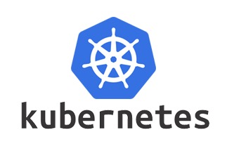
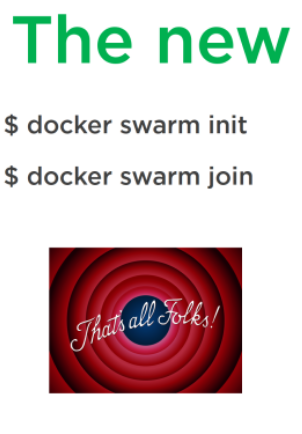

# ¿Qué es la orquestación de contenedores?

> La orquestación de contenedores se trata fundamentalmente de administrar el ciclo de vida de los contenedores, especialmente en entornos dinámicos donde coexisten múltiples aplicaciones y servicios. Los equipos de desarrollo y operaciones utilizan la orquestación de contenedores para controlar y automatizar un conjunto de tareas:

- Suministro y despliegue de contenedores.
- Redundancia y alta disponibilidad de los servicios que se ejecutan en los contenedores.
- Escalado y purgado horizontal de contenedores para repartir la carga equitativamente entre las máquinas que componen la infraestructura de alojamiento.
- Mover contenedores de un host a otro si hay escasez de recursos en un host o si un host deja de funcionar.
- Descubrimiento de servicios (service discovery) entre las partes que componen la aplicación.
- Equilibrio de carga entre los contenedores que componen un servicio.
- Supervisión del estado de contenedores y hosts que se ejecutan en el clúster.
- Exposición al exterior de los servicios que discurren en el interior de los contenedores.
- Configuración de la aplicación en relación con la infraestructura del contenedor donde se encuentra alojada.

# El paradigma de la contenerizacion

A estas alturas del curso ya estamos entendiendo por qué los contenedores son un cambio de paradigma en el mundo de los sistemas, comparable al de la virtualización de máquinas.

- Gracias a los contenedores podemos aislar un proceso y sus dependencias en una unidad que se puede iniciar/detener en cuestión de segundos.
- El costo de contenerización en términos de CPU/Memoria es totalmente insignificante.
- Podemos expresar cómo construir una imagen en código (Dockerfile), lo que presenta importantes [ventajas](https://en.wikipedia.org/wiki/Infrastructure_as_code).
- La posibilidad de crear infraestructuras basadas en microservicios está abierta a todos.

Como lo vemos, la idea es dividir nuestro sistema en unidades funcionales pequeñas y manejables que se comunican entre sí para hacer un trabajo más grande.

Un símil que se usa a menudo es el de la programación orientada a objetos:

- Así como en POO tenemos clases e instancias, en contenerización tenemos imágenes y objetos.
- La idea clave es encapsular la funcionalidad en unidades independientes que se comunican entre sí a través del paso de mensajes.
- La evolución del sistema se realiza mediante la ampliación/creación de nuevas clases y objetos, no mediante la modificación de los existentes.

Por lo tanto, la contenerización introduce un nuevo paradigma de diseño de aplicaciones e infraestructuras en el que:

- El sistema está fragmentado en unidades muy pequeñas, siendo el bloque de construcción mínimo **el contenedor**.
- Cada unidad tiene una funcionalidad específica y bien definida ([Separación de intereses](https://en.wikipedia.org/wiki/Separation_of_concerns)).
- Logrando esta modularidad, las distintas partes pueden ser vistas como **microservicios** que exponen una interfaz clara para comunicarse y que trabajan en conjunto para asegurar el cumplimiento de los objetivos del sistema como entidad.
- Además, nuestras aplicaciones finalmente son **escalables horizontalmente**, agregando nuevas instancias (contenedores) podemos aumentar la potencia de nuestra aplicación sin tener que recurrir a la jaula del **escalado vertical**.

# El problema del paradigma de la orquestación

Bien, ahora tenemos claro que tenemos que dividir todo en pequeñas unidades que se comuniquen entre sí. Pero ¿cómo hacemos eso?

Comencemos con una aplicación Php simple dentro de un contenedor:

Nuestra aplicación quiere tener **estado**. La solución obvia es agregar una base de datos dentro del contenedor:

Esto, a pesar de lo que sería una solución obvia, es un horror y una ruptura con el paradigma de la contenerización:

- El contenedor no tiene una sola preocupación, tiene dos (administración de bbdd y aplicación Php).
- El cambio en la bbdd o en la aplicación implica cambiar el resto de equipos.
- Introducimos las dependencias del software Mysql con respecto a la Separación de intereses a Php y viceversa.

El problema sería peor si quisiéramos, por ejemplo, agregar soporte para SSL, un servidor web, soporte para métricas y registros... Nuestro contenedor crecería y crecería, por lo que no arreglaríamos ninguno de los problemas que queremos resolver o encima perderíamos las ventajas de la contenerización.

La solución correcta sería esta:

Ahora tenemos dos unidades independientes en dos contenedores. Podemos modificar uno sin afectar al otro. Las preocupaciones están debidamente separadas.

En este punto, nuestros contenedores también pueden **escalarse**, solo agregue nuevos contenedores de aplicaciones si es necesario:

Y, por supuesto, podemos añadir los servicios auxiliares que creamos necesarias, sin necesidad de modificar los contenedores que ya tenemos (**encapsulación**).

Como vemos, nuestra aplicación **crece añadiendo nuevas unidades funcionales**, **no modificando las existentes**. Esto trae las ventajas de las que ya te hemos hablado en el apartado anterior.

Pero, surgen preguntas:

- ¿Cómo sabe nuestro contenedor PHP la dirección y el puerto en el que escucha Mysql?
- ¿Cómo paramos/arrancamos todos los contenedores a la vez?
- Si se cae un contenedor y al recogerlo ha cambiado la IP, ¿cómo lo sabe el resto?
- ¿Cómo inyectamos configuraciones comunes a todos los contenedores?

> La **orquestación de contenedores** intenta responder a estas y muchas otras preguntas.

# Kubernetes: El estándar de facto

Lanzada originalmente por Google, como una nueva [versión abierta](https://github.com/kubernetes/kubernetes) de su proyecto Borg  ([Borg project](https://kubernetes.io/blog/2015/04/borg-predecessor-to-kubernetes/)) pero centrado en la gestión de contenedores Docker, se está convirtiendo en la herramienta de referencia para la orquestación de contenedores. Y el proyecto principal sobre el que se creó la [Cloud Native Computing Foundation](https://www.cncf.io/), que cuenta con el respaldo de los principales actores tecnológicos de la actualidad como Google, Amazon Web Services (AWS), Microsoft, IBM , Intel, Cisco y RedHat.

Kubernetes sigue ganando popularidad gracias también a la cultura DevOps y sus seguidores, ya que nos permite tener una plataforma como servicio (PaaS) en nuestra propia infraestructura, lo que también crea una abstracción de la capa de hardware para permitir a los desarrolladores centrarse en la evolución de las aplicaciones de la organización, en lugar de configurar máquinas. También es extremadamente portátil, ya que se ejecuta en [Amazon Web Services](https://aws.amazon.com/) (AWS), [Microsoft Azure](https://azure.microsoft.com/en-us/ ), [Google Cloud Platform](https://cloud.google.com/) (GCP), [DigitalOcean](https://www.digitalocean.com/products/kubernetes/),... y por supuesto en una instalación on-premise de la propia organización.

También nos permite mover cargas de trabajo entre diferentes proveedores sin tener que rehacer la aplicación o redefinir la infraestructura, lo que permite a las organizaciones estandarizarse en una plataforma y evitar estar atadas a un proveedor (vendor lock-in).

# Docker Swarm

Repasando las principales herramientas a día de hoy para realizar trabajos de orquestación de contenedores, no podemos pasar por alto la propia solución que integra directamente Docker dentro de su motor Docker: **Docker Swarm**, y que utilizaremos en uno de los ejercicios prácticos.

Aunque actualmente [Docker ha abandonado la carrera](https://blog.newrelic.com/technology/docker-kubernetes-future/) para posicionar a Docker Swarm como el orquestador estándar, a favor de Kubernetes, que ofrece junto con swarm en su [enterprise edition](https://www.docker.com/enterprise-edition), su idea ya no es competir con Kubernetes sino convertir a Swarm en una herramienta complementaria a este, gracias a su facilidad de uso e integración dentro de docker-engine y de cli gestionamos contenedores.

 Docker Swarm consiste en un conjunto de 2 o más máquinas (¡Físicas, virtuales, contenedores Docker!) donde el único requisito es que se ejecute el demonio Docker (docker engine). Estas máquinas se conectan entre sí formando un clúster, de forma que actúan como un único sistema, agrupando recursos y permitiendo desplegar un mayor número de servicios, escalarlos horizontalmente, ponerlos en alta disponibilidad… Y lo mejor de todo es que este clúster se monta con 2 comandos simples y se administra mediante la docker cli.

# Apache Mesos y Maratón

[Apache Mesos](http://mesos.apache.org/), ligeramente anterior a Kubernetes, es un proyecto de software abierto desarrollado originalmente por la Universidad de California en Berkeley.

Actualmente lo utilizan empresas como [Twitter, Uber y Paypal](https://www.linux.com/news/4-unique-ways-uber-twitter-paypal-and-hubspot-use-apache-mesos ), y su interfaz liviana le permite escalar fácilmente hasta 10,000 nodos (o más), y permite el desarrollo de frameworks donde evolucionar de forma independiente.

Sus API admiten lenguajes populares como Java, C++ y Python, y también ofrece alta disponibilidad de forma predeterminada.

Pero, a diferencia de Swarm o Kubernetes, Mesos solo brinda administración del clúster de nodos, por lo que hay varios frameworks por encima de Mesos, uno de los cuales es [Marathon](https://mesosphere.github.io/marathon/), una plataforma a nivel de producción para la orquestación de contenedores.
