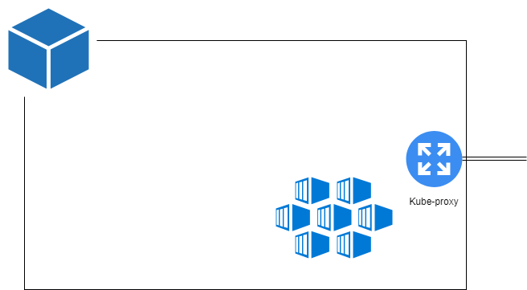

# Arquitectura de Kubernetes

Al hablar de la arquitectura de Kubernetes, distinguiremos dos partes:

- Infraestructura: nos referimos al conjunto de servidores que componen el clúster K8s.
- Componentes: hablaremos de los diferentes programas y herramientas que garantizan el funcionamiento interno de K8s.

## a) Infraestructura K8s

### Nodos

Kubernetes se implementará en **nodos**, que puede ser un nodo:

- Una máquina física.
- Una VM o máquina virtual.

La misión principal de los nodos es ejecutar nuestras cargas de trabajo en forma de contenedores. Todas las aplicaciones cliente de K8s se ejecutarán en nodos dentro del clúster.

Los nodos, también llamados **worker**, son los elementos que componen el clúster de Kubernetes. Un clúster puede estar compuesto por 1..N nodos.

La arquitectura de K8s es por tanto escalable, en el sentido de que puede adaptarse a las necesidades de la organización añadiendo o eliminando nodos del sistema. Esta arquitectura escalable es una de las claves de Kubernetes.

### Master

Hay una máquina o nodo especial que llaman "**master**" en el mundo de los K8s.

El Máster tiene tres tareas fundamentales:

- Exportar la API de comunicación con el clúster: el frontend de Kubernetes.
- Controlar el estado de todos los elementos "vivos" de K8s: contenedores, nodos, volúmenes...
- Gestionar los recursos del clúster, asignando nodos y volúmenes al resto de elementos.

Con master, podemos completar nuestro diagrama de arquitectura de Kubernetes de la siguiente manera:

## b) Componentes de Kubernetes

Los componentes principales de K8s se distribuyen entre el **master** y los **nodos**.

### Nodos

En los nodos encontramos los siguientes componentes:

- [**Kubelet**](https://kubernetes.io/docs/reference/command-line-tools-reference/kubelet/): el encargado de ejecutar contenedores en el nodo. Su trabajo es comunicarse con el motor del contenedor instalado en el nodo (Docker, rkt) y garantizar que todos los contenedores se ejecuten de acuerdo con las especificaciones establecidas en los pods (consulte la sección de artefactos).

- [**Kube-proxy**](https://kubernetes.io/docs/reference/command-line-tools-reference/kube-proxy/): es un componente que se ejecuta en los nodos y tiene la misión de garantizar el cumplimiento y la aplicación de las reglas de red y comunicación definidas a nivel de clúster.

- **Motor de contenedores**: puede ser Docker, rkt, containerd, cri-o. Esta es la herramienta que gestiona los contenedores en el nodo de bajo nivel.
Por lo tanto, nos quedamos con un esquema de nodo como este:

El nodo recibe comandos del master y los ejecuta utilizando Kubelet y Kube-proxy comunicándose con el motor contenedor instalado en la máquina.

## masters

De acuerdo con las tres misiones principales del master de Kubernetes, hay tres componentes principales que se ejecutan en este nodo especial:

- [**Kube-apiserver**](https://kubernetes.io/docs/concepts/overview/components/#master-components): Es el elemento principal de Kubernetes y expone la parte más importante del sistema ( la API).
 - Punto de entrada al clúster y centro de información.
 - Validación de cualquier artefacto desde el punto de vista de sintaxis, reglas de marcado...
 - Responsable de mantener el estado del clúster a través de la manipulación exclusiva de un bbdd clave-valor: el [etcd](https://github.com/etcd-io/etcd).

- El [**kube-controller-manager**](https://kubernetes.io/docs/concepts/overview/components/): la "inteligencia" de Kubernetes. Donde residen todos los controladores (Deployments, Daemonsets...) que son los artefactos encargados de monitorizar y tomar decisiones según el estado "deseado" y el estado real del clúster.

- [**Kube-scheduler**](https://kubernetes.io/docs/concepts/overview/components/): encargado de enviar las cargas de trabajo (en forma de contenedores) a los diferentes nodos según su nivel de ocupación, uso de CPU y memoria, etc...

