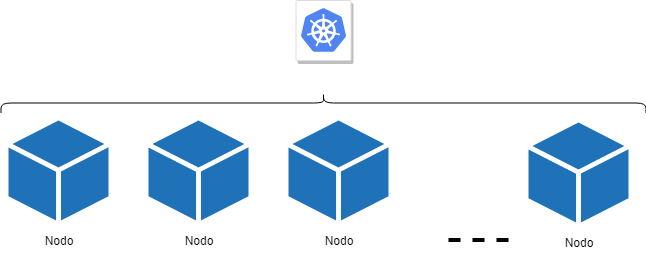
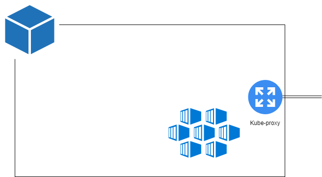
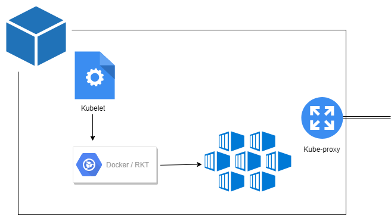
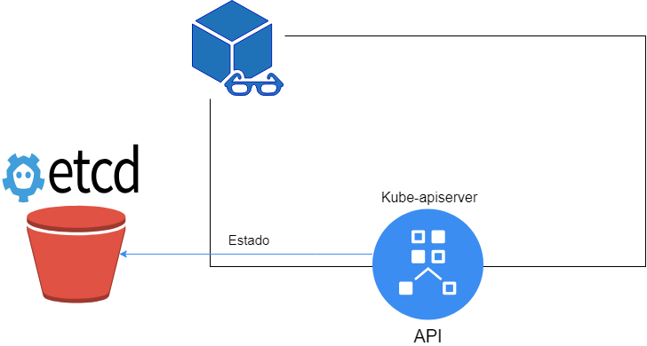
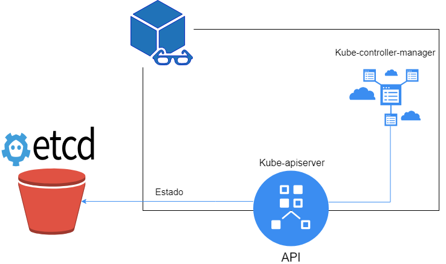
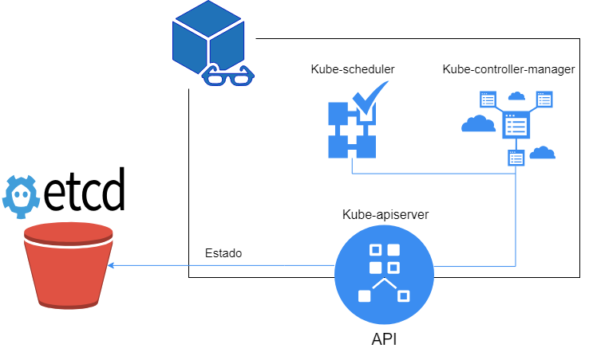

# Arquitectura de Kubernetes

Ó falar da arquitectura de Kubernetes, imos distinguir dúas partes:

- Infraestrutura: estamos a nos referir o conxunto de servidores que constitúen o clúster de K8s.
- Compoñentes: falaremos dos distintos programas e ferramentas que garanten o funcionamento interno de K8s.

## a) Infraestrutura de K8s

### Nodos

Kubernetes vaise despregar sobre **nodos**, puidendo ser un nodo:

- Unha máquina física.
- Un VM ou máquina virtual.

Os nodos teñen como misión fundamental correr as nosas cargas de traballo en forma de contedores. Todas as aplicacións cliente de K8s correrán en nodos dentro do clúster. 

Os nodos, tamén chamados **workers**, son os elementos de composición do clúster de Kubernetes. Un clúster poderá estar composto de 1..N nodos. 

A arquitectura de K8s é, por tanto, escalable, no sentido de que pódese adaptar ás necesidades da organización mediante o engadido ou supresión de nodos ó sistema. Esta arquitectura baseada nun escalado horizontal é unha das claves de Kubernetes. 

### O máster

Existe unha máquina ou nodo especial ó que dan en chamar "**master**" no mundo de K8s.

O máster ten tres tarefas fundamentais:

- Exportar a API de comunicación co clúster: o frontend do Kubernetes.
- Controlar o estado de todos os elementos "vivos" do K8s: contedores, nodos, volumes...
- Xestionar os recursos do clúster, asignando nodos e volumes ó resto dos elementos.

Co máster, podemos completar o noso diagrama da arquitectura de Kubernetes como segue:

## b) Compoñentes de Kubernetes

Os compoñentes básicas de K8s distribúense entre o **máster** e os **nodos**.

### Nodos

Nos nodos atopamos os seguintes compoñentes:

- [**Kubelet**](https://kubernetes.io/docs/reference/command-line-tools-reference/kubelet/): o encargado de correr contedores no nodo. O seu traballo é o de comunicarse co motor de contedores instalado no nodo (Docker, rkt) e asegurarse que tódolos containers están a funcionar segundo as especificacións establecidas nos pods (ver sección de artefactos).

- [**Kube-proxy**](https://kubernetes.io/docs/reference/command-line-tools-reference/kube-proxy/): é un compoñente que corre nos nodos e ten como misión asegurar o cumprimento e vixencia das regras de redes e comunicación segundo están definidas a nivel de clúster.

- **Motor de contedores**: pode ser Docker, rkt, containerd, cri-o. Trátase da ferramenta que xestiona os contedores no nodo a baixo nivel.
Queda, polo tanto, un esquema do nodo deste xeito:

O nodo recibe ordes do máster e as executa mediante o Kubelet e o Kube-proxy comunicándose co motor de contedores instalado na máquina.

## Máster

En concordancia coas tres misións fundamentais do máster de Kubernetes, existen tres grandes compoñentes que corren neste nodo especial:

- [**Kube-apiserver**](https://kubernetes.io/docs/concepts/overview/components/#master-components): é o elemento principal de Kubernetes e o que expón a parte máis importante do sistema (a API).
 - Punto de entrada ó clúster e centro de información.
 - Validación de calqueira artefacto dende o punto de vista da sintaxe, regras de marcado...
 - Responsable de manter o estado do clúster a través da manipulación en exclusiva dunha bbdd de clave-valor: o [etcd](https://github.com/etcd-io/etcd).

- O [**kube-controller-manager**](https://kubernetes.io/docs/concepts/overview/components/): a "intelixencia" do Kubernetes. Onde residen tódolos controladores (Deployments, Daemonsets...) que son os artefactos encargados de vixiar e tomar decisións segundo o estado "desexado" e o estado real do clúster.

- [**Kube-scheduler**](https://kubernetes.io/docs/concepts/overview/components/): encargado de enviar as cargas de traballo (en forma de contedores) ós distintos nodos segundo o seu nivel de ocupación, emprego de CPU e memoria, etc...

