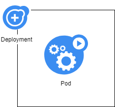

# Artefactos en Kubernetes: Deployment

En la sección anterior, exploramos los Pods como un artefacto de composición de aplicaciones central dentro de Kubernetes.

A pesar de ser un concepto clave para entender el resto del sistema, lo cierto es que **rara vez usaremos directamente un pod** en nuestro trabajo de Kubernetes. La mayor parte del tiempo vamos a trabajar con Deployments.

## a) ¿Por qué necesitamos los deployments?

Los deployments añaden "inteligencia" a nuestros pods, es decir, son elementos externos a los pods que los controlan e inspeccionan constantemente para poder:

- Monitor (el número de pods en ejecución es exactamente el especificado).
- Escalarlos (aumentar o reducir su número según las necesidades establecidas)
- Actualizarlos: permitir un cambio de configuración o imagen de los pods de forma controlada.
- Pausar / reanudarlos


## b) Definir una Deployment

Para definir un deployment, tenemos que pensar en ella como una estructura que está por encima del pod:



En el siguiente ejemplo:

- Vamos a crear un deployment llamado "despregue-nginx".
- Tiene la capacidad de implementar pods nginx. Cada pod ejecutará un contenedor con una imagen nginx.
- El contenedor tiene el puerto 80 expuesto.

```yaml
# deployment_1.yaml

apiVersion: apps/v1
kind: Deployment  # esta parte define o Deployment
metadata:
  name: despregue-nginx
  labels:
    app: nginx
spec:
  replicas: 1
  selector:
    matchLabels:
      app: nginx
  template: # a partir de aquí definimos o pod
    metadata:
      labels:
        app: nginx
    spec:
      containers:
      - name: nginx
        image: nginx:1.7.9
        ports:
        - containerPort: 80
```

Si enviamos este archivo a kubernetes:

```shell
kubectl apply -f deployment_1.yaml
```

Veremos cómo crear un pod.

```shell
despregue-nginx-6dd86d77d-4prgf   0/1     Pending       0          0s
despregue-nginx-6dd86d77d-4prgf   0/1     ContainerCreating   0          0s
despregue-nginx-6dd86d77d-4prgf   1/1     Running             0          2s
```

Y tendremos un nuevo tipo de artefacto: el deployment.

Podemos enumerarlos:

```shell
kubectl get deploy
```

y veremos

```shell
NAME              READY   UP-TO-DATE   AVAILABLE   AGE
despregue-nginx   1/1     1            1           7m48s
```

### i) La tarea de "vigilante" del Deployment

Si ahora enumeramos los pods que tenemos en ejecución y eliminamos el pod de nginx:

```shell
# o nome variará na vosa máquina
kubectl delete pod despregue-nginx-976fb94cd-l8ksl
 ```

Veremos que se elimina el pod y se crea uno nuevo inmediatamente:

```shell
despregue-nginx-976fb94cd-l8ksl   1/1     Running   0          90s
despregue-nginx-976fb94cd-l8ksl   1/1     Terminating   0          2m42s
despregue-nginx-976fb94cd-ngw7t   0/1     Pending       0          0s
despregue-nginx-976fb94cd-ngw7t   0/1     ContainerCreating   0          0s
despregue-nginx-976fb94cd-ngw7t   1/1     Running             0          1s
```

qué sucedió ¿Por qué se eliminó ese pod y se creó uno nuevo?

La razón está en el Deployment.

1. La implementación está monitoreando los pods (en este caso solo hay uno)
2. Eliminamos el pod a mano (usando delete pod)
3. La implementación detecta que el pod no se está ejecutando
4. Cree inmediatamente un nuevo pod con la misma configuración e imagen

Es decir: el Deployment controla cualquier alteración o falla de los pods y asegura que el sistema se “recupere” del bloqueo.

### ii) La tarea de escalado/desescalado de un deployment

En este momento, tenemos un solo pod que ejecuta nginx. Imaginemos que queremos ejecutar tres pods (tres réplicas, ya que todos tendrían la misma configuración).

Podemos hacer este trabajo directamente con kubectl scale:

```shell
 kubectl scale deploy despregue-nginx --replicas=3
```

Si vemos las Pods tendremos:

```shell
>  kubectl get pods -w

despregue-nginx-976fb94cd-ngw7t   1/1     Running   0          7m28s
despregue-nginx-976fb94cd-4z54k   0/1     Pending   0          0s
despregue-nginx-976fb94cd-v2jrc   0/1     Pending   0          0s
despregue-nginx-976fb94cd-4z54k   0/1     ContainerCreating   0          0s
despregue-nginx-976fb94cd-v2jrc   0/1     ContainerCreating   0          0s
despregue-nginx-976fb94cd-v2jrc   1/1     Running             0          1s
despregue-nginx-976fb94cd-4z54k   1/1     Running             0          2s
```


Y si enumeramos los Deployments:

```shell
> kubectl get deploy

NAME              READY   UP-TO-DATE   AVAILABLE   AGE
despregue-nginx   3/3     3            3           22m
```

Para volver a la situación inicial de una sola réplica (pods = 1), bastaría con hacer:

```shell
kubectl scale deploy despregue-nginx --replicas=1
```

Y veríamos como se eliminarían dos Pods restando sólo una de ellas.


### iii) La tarea de actualizar los módulos de implementación

En estos ejemplos, estamos ejecutando la versión 1.7.9 de nginx. Imaginemos que queremos ejecutar la versión 1.15.

Para ello también podemos usar deployment y hacer una actualización ordenada y “civilizada” de nuestros pods.

Supongamos también que queremos registrar el cambio en nuestro artefacto original (deployment_1.yaml)

Editémoslo y modifiquemos la línea de imagen del mismo:

```yaml
# deployment_1.yaml

apiVersion: apps/v1
kind: Deployment  # esta parte define o Deployment
metadata:
  name: despregue-nginx
  labels:
    app: nginx
spec:
  replicas: 1
  selector:
    matchLabels:
      app: nginx
  template: # a partir de aquí definimos o pod
    metadata:
      labels:
        app: nginx
    spec:
      containers:
      - name: nginx
        image: nginx:1.15 # este é o cambio!!!!
        ports:
        - containerPort: 80
```

Simplemente vuelva a aplicar este archivo modificado:

```shell
# aplicamos o ficheiro
kubectl apply -f deployment_1.yaml

# facemos un listado dos pods
kubectl get pods -w
```

Veremos que los pods iniciales pasan al estado de "terminación" y se lanzan otros nuevos (con la nueva imagen).

Deploy maneja esta tarea por nosotros.

Si no queremos modificar el código yaml de nuestro archivo de implementación, existe otra opción: **editar el artefacto existente en Kubernetes**.

Compre usando el comando **edit**:

```shell
kubectl edit deploy despregue-nginx
```

El comando kubectl abrirá una instancia vim con el código yaml del artefacto para poder realizar cambios que, una vez guardados, se realizarán automáticamente en el deployment y sus pods.
