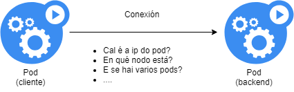
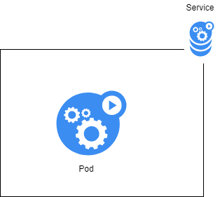
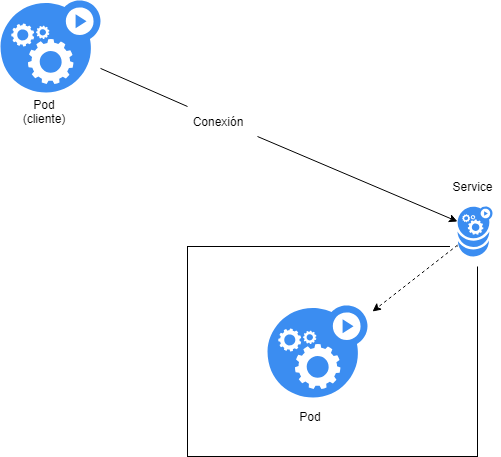
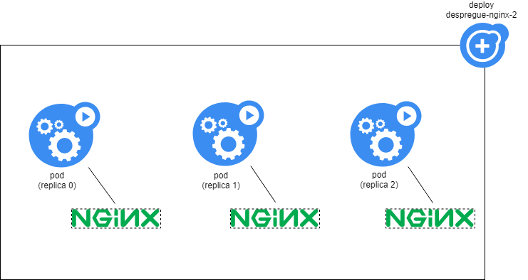
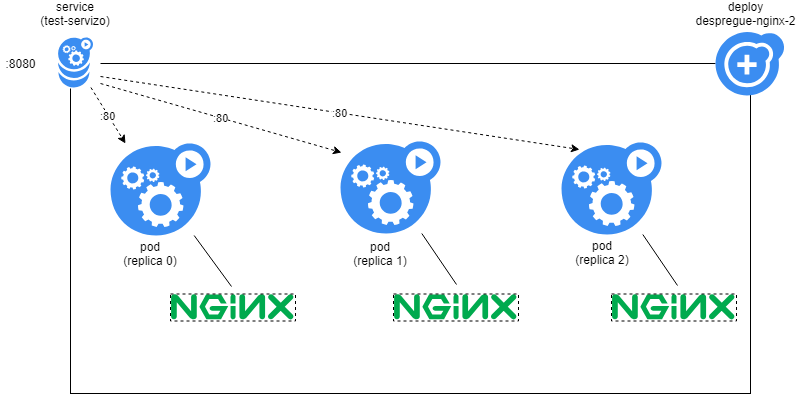

# Artefactos en Kubernetes: Service

Debido a que Kubernetes nos permite fragmentar nuestra aplicación en múltiples componentes, cada uno ejecutándose en un pod separado (en contenedores), queremos que los pods puedan comunicarse entre sí. Por ejemplo, un pod con nuestra aplicación PHP hace conexiones con otro pod que lleva una base de datos Mysql, con otro pod que lleva los registros, etc...

Que los pods puedan comunicarse entre sí implica un problema importante:

- ¿Cuál es la dirección IP del pod para conectarse?
- ¿Qué sucede si se está ejecutando en otro nodo?
- ¿Qué pasa si hay múltiples réplicas de la cápsula? ¿A cuál nos conectamos?



Kubernetes resuelve este problema utilizando un nuevo artefacto: **el servicio**.

Un servicio ([service](https://kubernetes.io/es/docs/concepts/services-networking/service/)) es un artefacto que establece reglas de acceso a un pod o conjunto de pods, es el elemento que garantiza la conexión externa de los pods. Cuando hablamos de "externo" nos referimos tanto a la conexión desde otros pods como desde fuera del clúster de Kubernetes.

Esta es una construcción que le permite abstraer los pods que realmente funcionan como backend de una aplicación cliente o frontend. A través de los servicios, cualquier aplicación cliente puede "despreocuparse" de dónde se están realizando las llamadas a los programas o aplicaciones que sirven como backend.



El servicio define principalmente:

- Un punto final de acceso: en realidad una entrada en Kubernetes DNS asociada a una ip. Los pods pueden hacer una búsqueda de DNS de kubernetes para encontrar esa IP.
- Reglas para el manejo de solicitudes: si hay varios pods, se establecen políticas de respuesta como: rr (round robin), lc (menos conectados)...



## Creación de un servicio

Para crear servicios podemos acudir al DSL de K8s.

```yaml
# servicio_1.yaml

tipo: Servicio
apiVersión: v1
metadatos: # esta es la parte de identificación del servicio
  nombre: primer servicio
especificaciones:
  selector: # esta es la parte de selección
    aplicación: nginx
  puertos: # esta es la parte de especificación en sí
  - protocolo: TCP
    puerto: 80
    puerto de destino: 80
```

Como podemos ver hay tres partes a definir en un servicio:

- Parte de identificación: donde establecemos el nombre del servicio (lo que usarán los pods-clientes para conectarse)
- Parte de selección: donde se define el pod o pods a los que se conecta el servicio.
- Parte de red: donde definiremos los parámetros de red:
  - Protocolo a utilizar
  - Puerto de conexión de servicio (puerto)
  - Puerto de conexión a los pods que abstrae el servicio (targetPort)

Tomando el ejemplo de implementación de nginx de la sección anterior, démosle conectividad orientada hacia el exterior.

Lanzamos el siguiente deployment:

```yaml
# deployment_service.yaml

apiVersión: apps/v1
tipo: Deployment # esta parte define el Deployment
metadatos:
  nombre: desplegar-nginx-2
  Etiquetas:
    aplicación: nginx-ejemplo
especificaciones:
  réplicas: 1
  selector:
    etiquetas de coincidencia:
      aplicación: nginx-ejemplo
  template: # a partir de aquí definimos el pod
    metadatos:
      Etiquetas:
        aplicación: nginx-ejemplo
    especificaciones:
      contenedores:
      - nombre: nginx
        imagen: nginx:1.15
        puertos:
        - puerto contenedor: 80
```

lo empezamos

```concha
kubectl apply -f deployment_servizo.yaml
```

Lo escalamos a 3 repeticiones.

```concha
Deployment de escala kubectl deployment-nginx-2 --replicas=3
```

Y tendríamos el siguiente esquema montado en nuestro clúster:



Ahora bien, si queremos otorgar conectividad a nuestro deployment, tendremos que crear un servicio. Para ello, utilizaremos el siguiente artefacto:

```yaml
# prueba_servicio.yaml

tipo: Servicio
apiVersión: v1
metadatos:
  nombre: servicio de prueba
especificaciones:
  selector:
    aplicación: nginx-ejemplo
  puertos:
  - protocolo: TCP
    puerto: 8080
    puerto de destino: 80
```

Creamos el artefacto en el sistema.

```concha
kubectl apply -f test_service.yaml
```

Y listamos los servicios del K8s para ver si realmente lo hemos creado

```concha
servicios de obtención de kubectl

NOMBRE TIPO CLÚSTER-IP IP EXTERNA PUERTO(S) EDAD
kubernetes ClusterIP 10.152.183.1 <ninguno> 443/TCP 26h
servicio de prueba ClusterIP 10.152.183.239 <ninguno> 8080/TCP 5m19s
```

Lo que acabamos de hacer es lo siguiente:

- Declaramos la existencia de un nuevo artefacto (un servicio)
- El servicio se llama "test-service"
- Aplica (selecciona) todos los pods que cumplan con las características de tener una etiqueta (app=nginx-example)
- El puerto de acceso al servicio es 8080
- Se enviarán solicitudes al puerto 80 de un pod que cumpla con las características del selector.

En un diagrama:



Para probar nuestro servicio usaremos kubectl-run, que nos permite crear una implementación "ad hoc" y ejecutar un comando "dentro" del contenedor.

```shell
kubectl run test-curl -ti --image=yauritux/busybox-curl sh
```

Si ejecutamos este comando, nos aparecerá un shell especial (el del contenedor creado) y desde ahí curlemos el servicio:

```shell
/home# curl test-servizo:8080
```

Y obtendremos la respuesta predeterminada de nginx:

```html
<!DOCTYPE html>
<html>
<head>
<title>Welcome to nginx!</title>
<style>
    body {
        width: 35em;
        margin: 0 auto;
        font-family: Tahoma, Verdana, Arial, sans-serif;
    }
</style>
</head>
<body>
<h1>Welcome to nginx!</h1>
<p>If you see this page, the nginx web server is successfully installed and
working. Further configuration is required.</p>

<p>For online documentation and support please refer to
<a href="http://nginx.org/">nginx.org</a>.<br/>
Commercial support is available at
<a href="http://nginx.com/">nginx.com</a>.</p>

<p><em>Thank you for using nginx.</em></p>
</body>
</html>
```

Vemos que:
- Cualquier pod dentro de kubernetes (y en el espacio de nombres correcto) tiene acceso al servicio, solo sepa:
   - el nombre del servicio
   - el puerto de conexión (del servicio)
   - No es necesario realizar ninguna configuración en el módulo del cliente.
- Al pod del cliente no le importa la cantidad de réplicas, el nodo en el que se encuentra el pod nginx, su ip, etc.
- ¿Cuál es la réplica del pod nginx que nos está respondiendo? la respuesta es que no sabemos: el sistema envía a un pod aleatorio. Veremos más adelante que esto es configurable.

Para terminar, tenemos que borrar todo lo que creamos:

```shell
# borramos o servizo
kubectl delete -f test_servizo.yaml

# borramos o despregue
kubectl delete -f deployment_servizo.yaml

# borramos o despregue de test
kubectl delete pod test-curl
```
