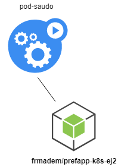
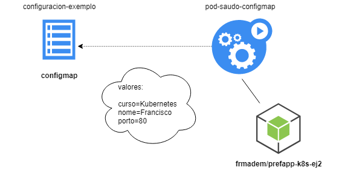

# Configuraciones en Kubernetes

Uno de los problemas que encontramos con los contenedores de software es su configuración: es decir, cómo establecer los valores y datos que hacen que nuestro sistema funcione como queremos.

Dado que un contenedor está aislado del contexto, "inyecta" esa configuración de tal manera que:

* Las imágenes están listas para funcionar con una configuración que se dará desde el "exterior".
* El contenedor hace la menor cantidad posible de "suposiciones" para que pueda ejecutarse en cualquier contexto con cambios mínimos; ya sea en desarrollo, pruebas, producción...
* Dado que la información se inyecta dentro del contenedor, debe proteger los datos confidenciales: contraseñas, contraseñas, claves ssh ...

La solución proporcionada por K8s es crear dos nuevos tipos de artefactos:

* [Configmaps:](https://cloud.google.com/kubernetes-engine/docs/concepts/configmap?hl=es-419) almacena información no confidencial.  
* [Secrets:](https://kubernetes.io/docs/concepts/configuration/secret/) artefactos que almacenan información confidencial con acceso limitado.

Estos elementos son repositorios de información que los pods pueden utilizar de diferentes formas:

* Como variables de entorno directamente accesibles a través de env.
* Como archivos que están montados en algún lugar dentro del sistema de archivos del contenedor.
* Como directorios de acceso restringido.

## Gestión de información no confidencial: configMaps

Un ConfigMap es un artefacto de Kubernetes que contiene información de configuración:

* Al ser un artefacto, puedes interactuar con él a través de Kubectl para crearlo, destruirlo, editarlo y clonarlo.
* Centralice la configuración que pueden usar los pods para administrar su propio comportamiento.

### a) Creación de un mapa de configuración

Hay varias formas de crear un ConfigMap.

Usemos un artefacto:

```yaml
# configmap_exemplo.yaml
#
apiVersion: v1
kind: ConfigMap # o tipo de artefacto
metadata:
  name: configuracion-exemplo # ten un nome
  labels:
    tipo: "exemplo"  # podemoslle meter labels
    modulo: "3"
data:
  nome: "Francisco" # aquí temos clave=valor como configuración
  curso: "Kubernetes"
  porto: "8080"
```

Si lo creamos con kubectl:

Input
```sh
kubectl apply -f configmap_exemplo.yaml
```

Veremos que se ha creado un nuevo objeto en nuestro k8s:

Input
```sh
kubectl get configmap
```
Output
```sh
NAME                                DATA   AGE
configuracion-exemplo               3      9s
```

Y si hacemos una descripción del mismo:

Input
```sh
kubectl describe configmap configuracion-exemplo
```
Output
```sh
Name:         configuracion-exemplo
Namespace:    default
Labels:       modulo=3
              tipo=exemplo
Annotations:  kubectl.kubernetes.io/last-applied-configuration:
                {"apiVersion":"v1","data":{"curso":"Kubernetes","nome":"Francisco","porto":"8080"},"kind":"ConfigMap","metadata":{"annotations":{},"labels...

Data
====
curso:
----
Kubernetes
nome:
----
Francisco
porto:
----
8080
Events:  <none>
```

También podemos editarlo con "kubectl edit" o modificando el yaml y haciendo un "kubectl apply" nuevamente.

Finalmente, podemos eliminarlo:

Input
```sh
kubectl delete configmap configuracion-exemplo
```

### b) Usando nuestro mapa de configuración

Imaginemos que queremos usar un pequeño programa escrito en nodeJS que necesita una configuración simple:

* Un puerto de escucha
* Un nombre de maestro/estudiante
* Un curso al que pertenece ese profesor/alumno.

Nuestra aplicación podría ejecutarse en un pod como el siguiente:

```yaml
kind: Pod
apiVersion: v1
metadata:
  name: pod-saudo
spec:
  containers:
    - name: contedor
      image: frmadem/prefapp-k8s-ej2   # a imaxe a empregar
  restartPolicy: Never
```
Tendríamos la siguiente estructura:




Nuestra aplicación recopila su configuración (puerto, curso y nombre) de su entorno a través de env.

Para inyectar estas variables, podríamos hacerlo a través del propio pod:

```yaml
# pod_exemplo_2.yaml
kind: Pod
apiVersion: v1
metadata:
  name: pod-saudo
spec:
  containers:
    - name: contedor
      image: frmadem/prefapp-k8s-ej2   # a imaxe a empregar
      env:
        - name: "nome"
          value: "Francisco"
        - name: "curso"
          value: "Kubernetes"
        - name: "porto"
          value: "80"
  restartPolicy: Never
```

Si lanzamos esto:

Input
```
# arrancamos o pod
kubectl apply -f pod_exemplo_2.yaml
```
Input
```
# e expoñemos un porto
kubectl port-forward pod/pod-saudo --address=0.0.0.0 8888:80
```
Output
```
Forwarding from 0.0.0.0:8888 -> 80
Handling connection for 8888
```
Input
```
# unha petición dende o noso localhost
curl localhost:8888/saudo
```
Output
```
Hola Francisco benvido/a ó curso de Kubernetes
```

Sin embargo, esto tendría varios problemas:

* Estaríamos mezclando la configuración del propio pod (sistema) con la configuración del programa (operación interna)
* No pudimos cambiar fácilmente esta configuración.


Kubernetes facilita este trabajo al ofrecer un nuevo artefacto: configmap

Si usamos el configmap anterior:

```yaml
# configmap_exemplo.yaml
#
apiVersion: v1
kind: ConfigMap # o tipo de artefacto
metadata:
  name: configuracion-exemplo # ten un nome
  labels:
    tipo: "exemplo"  # podemoslle meter labels
    modulo: "3"
data:
  nome: "Francisco" # aquí temos clave=valor como configuración
  curso: "Kubernetes"
  porto: "8080"
```

Y ahora modificamos nuestro pod:

```yaml
kind: Pod
apiVersion: v1
metadata:
  name: pod-saudo-configmap
spec:
  containers:
    - name: contedor
      image: frmadem/prefapp-k8s-ej2   # a imaxe a empregar
      env:
        - name: "nome"
          valueFrom:
            configMapKeyRef:
              name: "configuracion-exemplo"
              key: "nome"

        - name: "curso"
          valueFrom:
            configMapKeyRef:
              name: "configuracion-exemplo"
              key: "curso"

        - name: "porto"
          valueFrom:
            configMapKeyRef:
              name: "configuracion-exemplo"
              key: "porto"

  restartPolicy: Never
```

Si aplicamos este artefacto, obtendríamos lo siguiente:



Sin embargo, a primera vista, el uso de ConfigMaps puede hacerle pensar que es mucho más detallado y complica nuestros pods:

* Permite que los pods usen configuraciones de diferentes ubicaciones (diferentes mapas de configuración)
* Desacopla o separa la configuración del programa de la configuración del sistema (la propia del pod)
* Diferentes artefactos (servicios, pods, implementaciones) pueden "extraer" la misma configuración.

Además, en Kubernetes hay formas de crear ConfigMaps desde [archivos y directorios](https://kubernetes.io/docs/tasks/configure-pod-container/configure-pod-configmap/#create-a-configmap) y los nuevos [ConfigMap Generators](https://github.com/kubernetes-sigs/kustomize/blob/master/examples/configGeneration.md).

## Gestión de información confidencial y crítica: Los secretos

Un [secret](https://kubernetes.io/docs/concepts/configuration/secret/#overview-of-secrets) es un artefacto de Kubernetes que usamos para administrar y contener información confidencial: contraseñas, tokens de acceso o claves ssh.

Los secretos se administran para que los pods puedan usarlos, pero como artefactos independientes.

### a) Crear un secreto

Hay varias formas de crear un secreto, pero al final todo da como resultado un artefacto que tiene la siguiente estructura:

```yaml
# o_meu_segredo.yaml
apiVersion: v1
kind: Secret
metadata:
  name: meu-segredo
type: Opaque
data: # aquí van os datos
  username: YWRtaW4=
  password: Y29udHJhc2luYWwK
Na sección "data" do artefacto, temos a información en formato clave-valor. Os valores estarán codificados en base64. 
```

Si creamos este secreto en nuestro k8s:

```shell
kubectl apply -f o_meu_segredo.yaml
```
Tendremos un nuevo artefacto en el sistema que podremos controlar como de costumbre:

```shell
# podemos listalo
kubectl get secrets

NAME                                                TYPE                                  DATA   AGE
meu-segredo                                         Opaque                                1      80s

# podemos borralo
kubectl delete secret meu-segredo

secret "meu-segredo" deleted
```

Los secretos están protegidos dentro de la API de Kubernetes. También es posible limitar el acceso a ellos para los usuarios del clúster.

### b) Uso de secretos en pods

Los secretos se pueden usar en pods como volúmenes para montar en su sistema de archivos o como variables de entorno para inyectar en el sistema.

Un pod que usa el secreto anterior:

```yaml
# redis.yaml
apiVersion: v1
kind: Pod
metadata:
  name: meu-redis
spec:
  containers:
  - name: contedor
    image: redis
    env:
      - name: SECRET_USERNAME
        valueFrom:
          secretKeyRef:
            name: meu-segredo
            key: username
      - name: SECRET_PASSWORD
        valueFrom:
          secretKeyRef:
            name: meu-segredo
            key: password
  restartPolicy: Never
```

Vemos que la forma de usar los secretos como variables de entorno es muy similar a la de ConfigMaps.

Si el secreto no existe, la creación del pod fallará.
