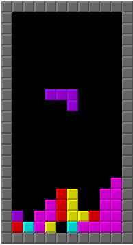
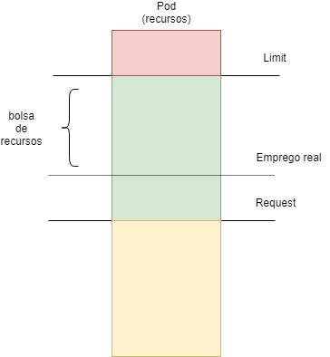
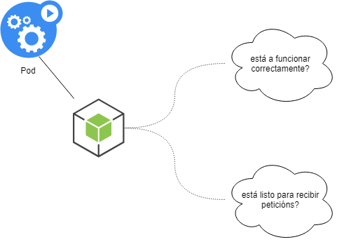

# Controlando os pods: límites e sondas

Sabemos que o pod é a unidade mínima de construcción, o bloque co que facemos as nosas aplicacións. 

Sen embargo, e ata agora, non falamos dunha serie de funcionalidades que nos va a permitir traballar moito mellor cos nosos pods. 

Dunha banda, Kubernetes traballa aloxando as nosas cargas de traballo (en forma de pods) nos nodos dispoñibles, isto implica que, dalgún xeito o K8s debería ser informado da carga que pode esperar do pod así como de o límite máximo que debe permitir para cada un deles. 

Por outro lado, os nosos pods deberían poder ter "extremos" ou "buracos" especiais para poder informar ó K8s de dúas cousas:

* De se o pod está "vivo": a aplicación está a correr sen problema. 
* De se o pod está "listo": ó arrancar o pod, cando está preparado para recibir peticións. 

Estos dous problemas resólvense en Kubernetes mediante os límites e as sondas.

## a) Límites e requests nos pods



O scheduler é o compoñente que se encarga de aloxar os pods nos diferentes nodos dun clúster de Kubernetes. Podemos pensar que xoga ó Tetris cos nosos pods. Polo tanto, compre que coñeza o "tamaño das pezas" coas que xoga. 

Nun pod, hai que establecer dúas medidas moi claras:

* Request: podemos pensar no request como os recursos mínimos que vai necesitar un pod para funcionar. Cando o scheduler fai o despregue dun pod nun nodo, está garantizado que terá eses recursos expresados no seu request. 
* Limits: esto establece a cantidad que máxima que pode pedir un pod.
 
Polo tanto un pod pódese expresar en función dos recursos que solicita do seguinte xeito:


Obviamente, cando falamos de "recursos", nos estamos a referir a:

* CPU: que será tratada como indica a [documentación oficial](https://kubernetes.io/docs/concepts/configuration/manage-resources-containers/#meaning-of-cpu). 
* Memoria: que terá o tratamento que indica a [comunidade](https://kubernetes.io/docs/concepts/configuration/manage-resources-containers/#meaning-of-memory) de Kubernetes. 

Deste xeito, os pods teñen sempre o request satisfeito cando son aloxados nun nodo polo scheduler. 

Agora ben:

* Un pod sempre terá reservados os recursos expresados no seu Request. Pero, se non está a empregar máis, eses recursos poden ser utilizados por outros pods. 
* Un pod pode solicitar recursos máis aló do seu Request, e sempre ata o seu Limits. 

Polo tanto, podemos pensar que o scheduler crea unha especie de "bolsa de recursos" coa CPU/Memoria non empregados ou inutilizados polos pods e a reparte entre os pods que poden solicitar máis do seu Request ata o Limits expresado no seu artefacto. 

É nesa parte "verde" do diagrama onde xoga o scheduler, sempre tendo que respetar os Request (a parte amarela) e nunca sobrepasando o Limits que está representado pola cor vermella. 



### i) Emprego de limits e requests nos pods

A expresión de requests e limits son os seguintes formatos:

* Memoria: pódese empregar E, P, T, G, M, K para expresar a cantidade de memoria ou os seus equivalentes en potencias de dous (Ei, Pi, Ti, Gi, Mi, Ki.)
* CPU: mídese en unidades de CPU (independientemente do número de cores) así 200m, implicaría 200 milicores. Hai unha explicación máis detallada neste [artigo](https://medium.com/@betz.mark/understanding-resource-limits-in-kubernetes-cpu-time-9eff74d3161b).

Na template do pod, reflectise deste xeito:

```yaml
# pod_limits_requests.yaml
kind: Pod
apiVersion: v1
metadata:
  name: pod-limites-requests
spec:
  containers:
    - name: contedor
      image: nginx   # a imaxe a empregar
      resources:
        requests:
          memory: "64Mi"
          cpu: "250m"
        limits:
          memory: "128Mi"
          cpu: "500m"
  restartPolicy: Never
```

Como vemos, estamos a establecer uns requests (a cantidade mínima de recursos) en 64Mi de RAM e 250m ou 250 milicores. 

Os limits están fixados en 128Mi de RAM e 500m ou 500 milicores. 

## b) Sondas nos pods

Como dixeramos ó principio desta unidade, K8s debe saber dun pod:

* Se está levantado e funcionando.
* Se está listo para recibir peticións.
 
 Kubernetes resolve estes problemas a través das sondas (probes).

As sondas son peticións http ou comandos a executar dentro do pod (dos contedores do pod) para determinar se a súa execución é exitosa ou non. En caso de non selo, K8s pode concluir que, ou ben o pod está inservible (o programa principal non está a funcionar) ou todavía non está listo para traballar (o programa principal do pod está todavía a arrancar).



Existen dous tipos esenciais de sondas:

* Readiness probe: sonda para determinar si o contedor do pod está listo ou non para recibir peticions. 
* Liveness probe: sonda que determina a "saúde" do contedor, si está a funcionar correctamente. 

### i) Definición dunha sonda

As sondas, como dixemos, son programas a executar ou peticións http a realizar. 

Unha sonda, sen importar o seu tipo, ten as seguintes partes:

* Comando ou URL de petición. 
* Argumentos do comando
* Segundos a agardar antes de enviar a primeira sonda. 
* Segundos a agardar entre o envío dunha sonda e a seguinte. 
 
Nun exemplo, temos o seguinte pod:

```yaml
# pod_sonda_live.yaml
kind: Pod
apiVersion: v1
metadata:
  name: pod-sonda-live
spec:
  containers:
    - name: contedor
      image: frmadem/catro-eixos-k8s-sonda
      livenessProbe:
        exec:
          command: # o comando a executar
            - cat
            - /etc/san
        initialDelaySeconds: 5
        periodSeconds: 5
```

Como vemos, no pod declárase unha sonda de liveness (proba de vida). 

Executa un comando (cat /etc/san) e vaise a executar tra-los 5 primeiros segundos de arranque do contedor (initialDelaySeconds) e a repitición cada 5 segundos (periodSeconds).  

Se o arrancamos:

Input
```sh
kubectl apply -f pod_sonda_live.yaml
```

Input
```sh
kubectl get pods
```

Output
```sh
NAME                                      READY   STATUS             RESTARTS   AGE
pod-sonda-live                            1/1     Running            0          3m19s
```
Agora, dende outra shell accedemos ó pod:

Input 
```sh
kubectl exec -ti pod-sonda-live -- bash
```

Output
```sh
root@pod-sonda-live:/#
```

E borramos o ficheiro /etc/san

Input
```sh
root@pod-sonda-live:/# rm /etc/san
```
Ó pouco tempo, veremos que K8s nos "bota fora" do contedor:

Output
```sh
root@pod-sonda-live:/# command terminated with exit code 137
```

E se vamos a ver os detalles do noso pod, veremos o seguinte:

Input
```sh
kubectl describe pod pod-sonda-live
```

Output
```sh
Events:
  Type     Reason     Age                 From                Message
  ----     ------     ----                ----                -------
  Normal   Scheduled  7m5s                default-scheduler   Successfully assigned default/pod-sonda-live to sutelinco
  Warning  Unhealthy  61s (x3 over 71s)   kubelet, sutelinco  Liveness probe failed: cat: /etc/san: No such file or directory
  Normal   Killing    61s                 kubelet, sutelinco  Container contedor failed liveness probe, will be restarted
```

Vemos que a sonda de live fallou e o contedor se reiniciou. De feito, se vemos a información dos pods:

Input
```sh
kubectl get pods
```
Output
```sh
NAME                                      READY   STATUS             RESTARTS   AGE
pod-sonda-live                            1/1     Running            1          8m6s
```

E vemos que hai un restart do noso contedor (no momento en que eliminamos o ficheiro). Cando se reinicie, o ficheiro volverá a estar no seu sitio por mor de que está incluído na imaxe. 

### ii) Definición dunha sonda de tipo petición http

Neste caso, imos crear unha sonda de ready (pod preparado) mediante unha petición http.

Temos o seguinte pod:

```yaml
# pod_sonda_http.yaml
kind: Pod
apiVersion: v1
metadata:
  name: pod-sonda-http
spec:
  containers:
    - name: contedor
      image: nginx:1.15
      readinessProbe:
        httpGet:
          path: /
          port: 80
        initialDelaySeconds: 15
        periodSeconds: 5
```

Lanzamos un pod con nginx. Creamos unha sonda de preparado e, agardando 15 segundos, fara un GET /. Repetirá esta operación cada 5 segundos ata que responda cun 200. 

Unha vez que responde, o pod ponse en estado de ready  e estará listo para recibir peticións. 

As sondas live e ready son moi importantes cando se traballa con deploy que teñen un número grande de réplicas. Pensemos:

* Cada vez que se inicia unha nova réplica, o pod non recibirá peticións a través do servizo mentres non esté en estado ready, é dicir: mentres a sonda (readinessProbe) non devolva ok. 
* Se un pod falla (o programa principal deixa de funcionar) a sonda de saúde (livenessProbe) detecta o fallo e reinicia o contedor. Mentres non volva a estar en estado de ready seguirá sen recibir peticións a través do servizo. 
 
Estas dúas sondas nos permiten controlar os pods e asegurar que ningunha petición se envía a un pod que esté en estado inestable.

### iii) Emprego de sondas con servizos e deploys

As sondas live e ready son moi importantes cando se traballa con deploy que teñen un número grande de réplicas. Pensemos:

- Cada vez que se inicia unha nova réplica, o pod non recibirá peticións a través do servizo mentres non esté en estado **ready**, é dicir: mentres a sonda (readinessProbe) non devolva ok. 
- Se un pod falla (o programa principal deixa de funcionar) a sonda de saúde (livenessProbe) detecta o fallo e reinicia o contedor. Mentres non volva a estar en estado de **ready** seguirá sen recibir peticións a través do servizo. 

Estas dúas sondas nos permiten controlar os pods e asegurar que ningunha petición se envía a un pod que esté en estado inestable. 