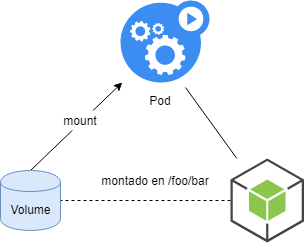
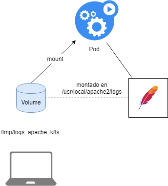

# Persistencia en K8s: los volúmenes

Hasta ahora, nuestras cargas de trabajo se ejecutan en módulos. El problema que tenemos es que si se reinicia un pod, o si lo borramos, perdemos datos que nos pueden interesar. Es decir: nuestros pods no tienen persistencia.

Para dar persistencia a nuestros pods, Kubernetes ofrece una solución: volúmenes.

## A) Definición de volumen

Un volumen es un recurso de Kubernetes que es externo a los contenedores de nuestros pods y por tanto no sigue su ciclo de vida:

* No se borra cuando se eliminan o reinician los contenedores de un pod.
* Los pods pueden acceder y montarlo como otra ruta en su sistema de archivos.
* Los volúmenes se pueden administrar de forma completamente independiente de los pods, implementaciones y servicios (volúmenes persistentes)

Además, los volúmenes pueden ser elementos externos al propio clúster de Kubernetes:

* Puede ser una unidad NFS montada en el clúster.
* Puede ser un volumen iscsi.
* Es posible conectar elementos de proveedores de nube pública y privada.

[Aquí](https://kubernetes.io/docs/concepts/storage/volumes/#types-of-volumes) podemos ver una lista extensa de sistemas de almacenamiento que Kubernetes puede usar como base para crear volúmenes.



## B) Uso de volúmenes locales

Uno de los tipos básicos de volúmenes son los llamados hostPath.

Permite que el volumen creado sea realmente un directorio en el host (nodo donde se ejecuta el pod).

Es muy cómodo de desarrollar y de trabajar pero tiene serias limitaciones:

* En el momento en que tenemos más de un nodo ya no se puede utilizar ya que no tenemos garantizado en qué nodo del clúster se ejecutará nuestro pod, por lo tanto puede encontrar esa ruta o no.
* Si el nodo deja de funcionar, se pierde toda la información de hostPath.

Sin embargo, podemos usarlo para ilustrar algunos de los puntos básicos de los volúmenes.

Partimos de este pod:

```yaml
# pod_con_volume.yaml
apiVersion: v1
kind: Pod
metadata:
  name: pod-con-volume
spec:
  containers:
  - image: frmadem/catro-eixos-k8s-apache2
    name: contedor
    volumeMounts:
    - mountPath: /usr/local/apache2/logs
      name: volume
  volumes:
  - name: volume
    hostPath:
      path: /tmp/logs_apache_k8s
      type: DirectoryOrCreate
```

Vemos que en la sección de volumen [13-17]:

* Declaramos un volumen
* Es de tipo hostPath
* Apuntamos a una carpeta en nuestro host (/tmp/logs_apache_k8s)
* Le decimos que lo cree si no existe (DirectoryOrCreate)

Luego, en la parte del contenedor [10-12]:

* Montamos el volumen en una sección de montajes de volumen
* Establecemos una ruta de montaje (/usr/local/apache2/logs)
* Y hacemos referencia al volumen declarado

Tenemos lo siguiente:



Ahora:

Input
```sh
# arrancamos o pod
kubectl apply -f pod_con_volume.yaml
```

Input
```sh
# exportamos o porto á nosa máquina
kubectl port-forward pod/pod-con-volume --address=0.0.0.0 8888:80
```

Input
```sh
# dende outra shell facemos un curl
curl localhost:8888/
```

Output
```sh
<html><body><h1>It works!</h1></body></html>
```

Ahora tenemos que ir a buscar el volumen al nodo de kind. Tenemos que descubrir en qué nodo se encuentra. Para esto usamos el comando:

Input
```
kubectl describe pod pod-con-volume
```

Output
```
Name:             pod-con-volume
Namespace:        default
Priority:         0
Service Account:  default
Node:             multi-node-worker2/172.20.0.3
Start Time:       Wed, 19 Oct 2022 15:19:47 +0200
....
...
```
En este caso está en el nodo multi-node-worker2. 

Como cada nodo de Kind es un contenedor docker, puedo abrir un bash en este contenedor para ver los logs en el volumen "persistente".

Input
```
docker exec -it multi-node-worker2 bash

root@multi-node-worker2:/# cat /tmp/logs_apache_k8s/access_log 
```


Output
```sh
# vemos os logs

127.0.0.1 - - [15/May/2019:14:32:28 +0000] "GET / HTTP/1.1" 200 45 "-" "curl/7.61.0"
127.0.0.1 - - [15/May/2019:14:32:28 +0000] "GET / HTTP/1.1" 200 45 "-" "curl/7.61.0"
127.0.0.1 - - [15/May/2019:14:32:28 +0000] "GET / HTTP/1.1" 200 45 "-" "curl/7.61.0"
127.0.0.1 - - [15/May/2019:14:32:29 +0000] "GET / HTTP/1.1" 200 45 "-" "curl/7.61.0"
127.0.0.1 - - [15/May/2019:14:32:29 +0000] "GET / HTTP/1.1" 200 45 "-" "curl/7.61.0"
127.0.0.1 - - [15/May/2019:14:32:29 +0000] "GET / HTTP/1.1" 200 45 "-" "curl/7.61.0"
127.0.0.1 - - [15/May/2019:14:32:31 +0000] "GET / HTTP/1.1" 200 45 "-" "curl/7.61.0"
127.0.0.1 - - [15/May/2019:14:32:31 +0000] "GET / HTTP/1.1" 200 45 "-" "curl/7.61.0"
127.0.0.1 - - [15/May/2019:14:32:31 +0000] "GET / HTTP/1.1" 200 45 "-" "curl/7.61.0"
127.0.0.1 - - [15/May/2019:14:32:33 +0000] "GET / HTTP/1.1" 200 45 "-" "curl/7.61.0"
127.0.0.1 - - [15/May/2019:14:32:34 +0000] "GET / HTTP/1.1" 200 45 "-" "curl/7.61.0"
127.0.0.1 - - [15/May/2019:14:32:34 +0000] "GET / HTTP/1.1" 200 45 "-" "curl/7.61.0"
127.0.0.1 - - [15/May/2019:14:32:35 +0000] "GET / HTTP/1.1" 200 45 "-" "curl/7.61.0"
```

