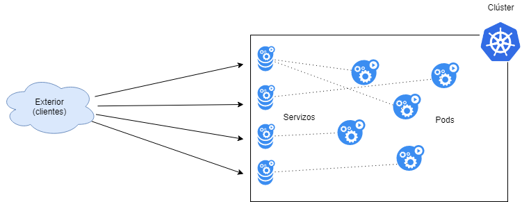
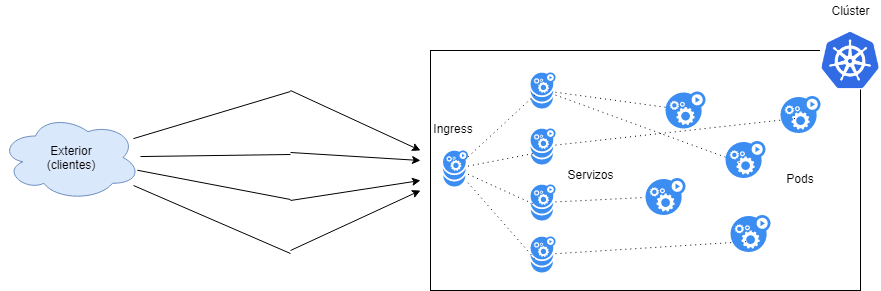

# Ingress: control del tráfico de entrada

Por lo que hemos visto hasta ahora, nuestros **servicios** tienen la responsabilidad en Kubernetes de reenviar las peticiones realizadas al pod o pods indicados en sus especificaciones.

A esos servicios se les asigna una IP de clúster y, con la configuración adecuada, se puede acceder desde el mundo exterior.

Sin embargo, esto presenta varios problemas:

- Por su propia naturaleza, un clúster K8s está llamado a tener muchos servicios y, por lo tanto, muchos puntos de entrada al clúster.
- Para que cada servicio sea accesible desde el exterior, se le debe asignar una IP pública.
- Implica por tanto que, a N servicios de acceso público, tendremos que asignarles N IPs públicas.
- Para cada servicio, si desea asegurarlo, deberá controlar los certificados SSL.



Tenemos que solicitar las IP públicas al proveedor, suelen ser caras y tardan en aprovisionarse.

Ante este problema, la comunidad de Kubernetes brinda una solución: **ingress**. 

## Ingress

Ingress es un sistema que actúa como un proxy inverso al exponer **un solo servicio al exterior** y reenviar las solicitudes que recibe a varios servicios según su configuración.



### a) Estructura y control de entrada

El [ingress](https://kubernetes.io/docs/concepts/services-networking/ingress/) consta de:
- **Servidor**: generalmente un Nginx, que maneja las conexiones actuando como un proxy inverso.
- **Controlador**: una aplicación que controla el servidor reprogramándolo de acuerdo con las reglas que se declaran.
- **Reglas**: artefactos de Kubernetes que declaran las acciones que debe realizar Ingress.

Por lo tanto, para poder utilizar las reglas de Ingress, necesitaremos tener un controlador instalado en nuestro clúster. Posteriormente haremos una práctica guiada explicando cómo configurar este controlador; mientras tanto, puede implementar un clúster listo para trabajar con ingress con el siguiente [fichero.sh](../00_solucions/03_solucion/despregar-cluster-con-registry-e-ingress.md).

#### i) Reglas en ingress

Como dijimos, las reglas de ingress son un artefacto de Kubernetes.

Una regla de ingress se compone de las siguientes partes:

- **Host**: hostname de la petición que determina la aplicación o no de la regla.
- **Rutas**: la ruta de la petición.
- **Backend**: el conjunto de *servicio* y *puerto* que configurará a dónde reenviar la petición.

Si vemos una regla simple:

```yaml
# exemplo ing.yaml
apiVersion: networking.k8s.io/v1
kind: Ingress
metadata:
  name: exemplo-ingress
spec:
  rules:
  - http:
      paths:
      - pathType: Prefix
        path: /
        backend:
          service:
            name: servizo-1
            port:
              number: 80
```

Vemos que este es un artefacto K8s, con lo que eso implica (declarativo, puede tener metadatos...)

En el artefacto, se declara:

- Un nombre: "exemplo-ingress"
- Una regla:
  - El tráfico de entrada por http
  - Si la url tiene el path "/servidor"
  - Reenviar al servicio "servizo-1"
  - A través del puerto 80

Ahora,

```shell
# creamos el artefacto
kubectl apply -f ing.yaml

# y hacemos una petición
curl localhost:<porto_ingress>/servizo

# responderá el servizo-1
```

Obviamente podríamos crear múltiples paths:

```yaml
apiVersion: networking.k8s.io/v1
kind: Ingress
metadata:
  name: ingress
  annotations:
    nginx.ingress.kubernetes.io/rewrite-target: "/"    # 6
    nginx.ingress.kubernetes.io/ssl-redirect: "false"  # 7
spec:
  rules:
  - http:
      paths:
      - pathType: Prefix
        path: /servizo
        backend:
          service:
            name: servizo
            port: 
              number: 8080
      - pathType: Prefix
        path: /test
        backend:
          service:
            name: servizo-test
            port: 
              number: 8888
```

En este ejemplo, tendríamos:
- Dos caminos '/servizo' y '/test' que se resolverían en dos servicios diferentes.
- ⚠️ **¡Cuidado!** El puerto es el del servicio, no el puerto de entrada ingress. Esto es importante de recordar.
- También podemos ver dos `annotations` (líneas 6 y 7). Estos son datos para controlar el propio ingress.
  - En la línea 6 decimos que es necesario que se redirija a `/` desde el servicio backend (`/servizo` o `/test` desaparecerían)
  - En la línea 7 estamos diciendo que no queremos una redirección a 443 (para ssl)

Uno de los elementos clave en ingress es que las reglas se expresan como un artefacto, por lo que podríamos:

```shell
# listar os ingress aplicables 
kubectl get ing

NAME                 HOSTS   ADDRESS     PORTS   AGE
o-meu-ingress   *       127.0.0.1   80      7h11m

# podríamos editarlo
kubectl edit ing o-meu-ingress

# podríamos borrarlo
kubectl delete ing o-meu-ingress
```
