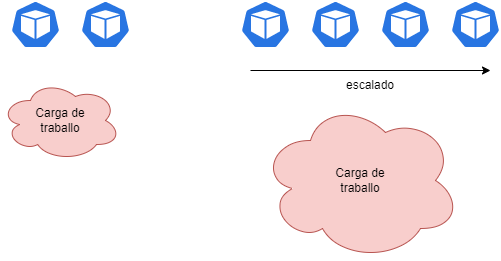

# Adaptarse a las demandas de carga: HPA

Una de las ventajas importantes que ofrece Kubernetes es que permite adaptar las capacidades informáticas de nuestros servicios a las demandas y cargas de trabajo solicitadas por los usuarios. Una de las medidas clave para esto es [HPA](https://kubernetes.io/docs/tasks/run-application/horizontal-pod-autoscale/): el Horizontal Pod Autoescaler. 

Se trata de un mecanismo que incorpora K8s que permitirá que nuestros deployments aumenten su número de réplicas según una serie de parámetros que podemos definir.



Como vemos en el diagrama, un aumento en la carga de trabajo requiere un aumento en la cantidad de pods para absorberlo. En consecuencia, cuando se reduzca esa carga, también lo hará la cantidad de pods. De esta manera **podemos adaptarnos a las variaciones en la carga de trabajo por la cantidad de pods que la procesan**.

De ahí el nombre de horizontal: no aumentamos los recursos asignados a un pod específico, aumentamos el número de pods de ese tipo, pudiendo superar las limitaciones de un nodo k8s y las de una unidad de ejecución simple.

## Gestión de la carga con HPA

El HPA es un artefacto independiente de kubernetes: podemos expresarlo en un archivo YAML y tendrá algunas especificaciones.

Conéctese directamente al ReplicaSet que implementa la deployment para aumentar o disminuir el **número de réplicas**.

Esta arquitectura tiene importantes ventajas:

* El hecho de que sea un artefacto independiente permite gestionarlo como los demás elementos de la maquinaria k8s.
* Se puede desplegar/modificar/eliminar independientemente del resto de la definición de nuestros servicios.

Por lo tanto, definir un HPA implica crear un nuevo artefacto de kubernetes:

```yaml

apiVersion: autoscaling/v2beta2 # hai varias versións en funcionamento a día de hoxe
kind: HorizontalPodAutoscaler

metadata:
  name: o-meu-hpa  
  # podería levar as súas annotations e labels

spec: 

  #-------------------------------------------------
  # Esta é a parte de selección de pods a escalar
  #-------------------------------------------------
  scaleTargetRef: 
    apiVersion: apps/v1
    kind: Deployment
    name: o-meu-deployment


  #-------------------------------------------------
  # Nesta parte establecemos os límites do escalado
  #-------------------------------------------------
  minReplicas: 1
  maxReplicas: 10

  
  #---------------------------------------------------
  # Nesta sección definimos os criterios (métricas)
  # segundo as que escalar
  #---------------------------------------------------
  metrics:
  - type: Resource
    resource:
      name: cpu
      target:
        type: Utilization
        averageUtilization: 50  

```
[Definición completa](https://kubernetes.io/docs/reference/generated/kubernetes-api/v1.22/#horizontalpodautoscaler-v2beta2-autoscaling)

Como vemos, un HPA tiene tres apartados fundamentales en sus especificaciones:

1. Una sección de **Selección**
2. Una sección de **Límites**
3. Una sección de **Criterios o Métricas**

### El uso de métricas en el HPA

Las métricas en las que nuestro HPA puede basar su trabajo son de [tres tipos fundamentales](https://kubernetes.io/docs/tasks/run-application/horizontal-pod-autoscale/#support-for-metrics-apis):

1. Tipo de recurso (básicamente CPU/memoria) que se puede exponer normalmente a través del [metrics-server](https://github.com/kubernetes-sigs/metrics-server).
2. Tipo Custom, que toman valores de los servicios de métricas proporcionados por el proveedor (Cloud Monitoring, Cloud Watch...) Se utilizan para que los pods puedan escalar según métricas distintas a las suyas propias.
3. Tipo External: para escalar nuestros pods según el estado de los servicios externos al nuestro (por ejemplo una cola de mensajes).

Estos tres grupos de métricas se exponen a través de APIs específicas:

1. Para métricas de tipo de recurso: metrics.k8s.io.
2. Para métricas de tipo Custom: custom.metrics.k8s.io.
3. Para métricas de tipo External: external.metrics.k8s.io.

Por tanto, y en función del resultado deseado, basaremos nuestro HPA en un tipo de métrica u otra.

### La interpretación de las métricas por parte de la HPA

El algoritmo que utiliza HPA para interpretar las métricas funciona como se explica en esta [sección de la documentación oficial](https://kubernetes.io/docs/tasks/run-application/horizontal-pod-autoscale/#algorithm-details). 

La idea básica es determinar el número de réplicas a través de una simple operación matemática:

```
Número de Rèplicas de Pods = Redondeo (valorActualMetrica / valorIdealMetrica )
```

Esto significa que:

1. El algoritmo calcula el valor actual de la métrica (si es un porcentaje, promedia ese valor entre todos los pods existentes). Si la métrica es de tipo **resource** (CPU o Memoria), el valor individual de cada pod se encuentra en función del uso actual con respecto a las solicitudes especificadas en el pod.
2. Toma el valor ideal (como se declara en el manifiesto del artefacto).
3. El producto del número actual de réplicas por el cociente entre la métrica actual y la ideal dará como resultado el número de réplicas a mantener.

En ejemplos:

* Uso de cpu 400, lo deseado es 100 --> Implica un aumento en los pods = 400/100 == 4.0
* Items en cola 500, lo deseado 300 --> Implica un incremento de pods = 500/300 = 2.0 (1.6 redondeado)

#### El problema del uso de la memoria como criterio de escalado/desescalado con HPA

La memoria se puede usar como una métrica en un HPA, sin embargo, es problemática:

1. Muchos lenguajes de programación y tiempos de ejecución liberan memoria poco a poco (o no la liberan directamente).
2. El uso de memoria no es en muchos casos una medida del nivel de "carga" de un proceso debido a las reservas que hacen algunos frameworks al iniciar.

Por estos motivos, no parece recomendable en la mayoría de los casos utilizar la memoria como criterio de escalado/desescalado de pods.

### La sección behavior: la gestión "por el pequeño" de nuestro HPA.

La sección __behavior__ de nuestro HPA nos permite establecer políticas de escalado/desescalado ante cambios en la cantidad de réplicas a aplicar.

Este es un elemento introducido a partir de la versión v2beta1 de HPA. La documentación oficial se puede encontrar [aquí](https://kubernetes.io/docs/tasks/run-application/horizontal-pod-autoscale/#configurable-scaling-behavior).

Podemos por tanto establecer dos grupos de políticas:

* **scaleDown**: Para controlar el desescalado de nuestro sistema.
* **scaleUp**: Para gestionar nuestro incremento de réplicas.

Si nos fijamos en un ejemplo de una política:

```yaml
behavior:
  scaleDown:
    policies:
    - type: Pods
      value: 4
      periodSeconds: 60
    - type: Percent
      value: 10
      periodSeconds: 60
```

Para empezar, vemos que hay dos políticas de desescalada:

* Lo primero que hay que tener en cuenta en el caso de múltiples políticas es que siempre aplica **la que tenga el mayor cambio**.

* En la primera política se expresa que es posible desincrustar hasta un máximo de 4 pods por minuto.

* En la segunda política es posible desescalar hasta el 10% del número de pods en un minuto de tiempo.

¿Cuál prevalecerá? Como decíamos dependerá del número de pods en cada iteración y siempre que sea cierto: 10% Número de Pods > 4.

Por otro lado, podríamos cambiar el sesgo de decisión de la política, bastaría con declarar el campo **selectPolicy** a Min.


```yaml
behavior:
  scaleDown:
    selectPolicy: Min # mudamos o sesgo á escolla da política con menor impacto
    policies:
    - type: Pods
      value: 4
      periodSeconds: 60
    - type: Percent
      value: 10
      periodSeconds: 60
```

Por último, existe la posibilidad de que la HPA "revise" las últimas elecciones que hizo en un período de tiempo determinado.

Por ejemplo:

```yaml
behavior:
  scaleDown:
    stabilizationWindowSeconds: 300  # ventana de 5 min
    policies:
    - type: Pods
      value: 4
      periodSeconds: 60
    - type: Percent
      value: 10
      periodSeconds: 60
```

Con el campo stabilizationWindowSeconds aseguramos que el valor más alto aplicado en los últimos 5 minutos es el que prevalece (podría ser el mínimo para cambiar el sesgo).

El objetivo es evitar las llamadas "flapping pods" o pods que se levantan y lanzan constantemente. Así, si una estabilización pasada tuvo un valor mayor/menor según el sesgo actual, este último no se aplica.


En la siguiente sección, haremos una práctica guiada sobre el HPA.
