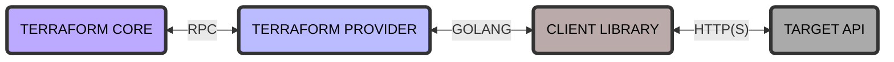

# Providers e recursos
## O provider
Un [provider](https://www.terraform.io/language/providers) en Terraform é un plugin que permite os usuario manexar unha API externa. Os plugins de provider funcionan como unha capa de abstracción que permite ó noso Terraform comunicar coas diferentes nubes, providers, databases e servizos.


As configuracións en Terraform requiren da declaración do provider que vamos a facer uso, para instalalo. Poderiamos decir que é a folla de ruta do noso proveedor, a cal usaremos para según as súas normas montar a infraestructura.

Terraform fai uso dos provider para aprovisionar os recursos, que describen un ou máis obxectos da infraestructura. Cada provider no [Terraform Registry](https://registry.terraform.io/) ten a súa documentación sobre uso e podemos escoller a versión que queremos emplear en todo momento.

Terraform dispón dunha ampla selección de providers, desenvolvidos por diversas fontes:
- HashiCorp
- Terraform Community
- Vendedores externos

Podemos ver a lista completa de de providers cos filtros de búsqueda [neste enlance](https://registry.terraform.io/browse/providers), entre os cales destacamos:
- [AWS](https://registry.terraform.io/providers/hashicorp/aws/latest)
- [Azure](https://registry.terraform.io/providers/hashicorp/azurerm/latest)
- [Google Cloud](https://registry.terraform.io/providers/hashicorp/google/latest)
- [Kubernetes](https://registry.terraform.io/providers/hashicorp/kubernetes/latest)
- [Alibaba Cloud](https://registry.terraform.io/providers/aliyun/alicloud/latest)

> ⚠️ **IMPORTANTE:** Sen un provider declarado non se pode manexar ningún tipo de configuración, polo que resulta imprescindible no noso código.

## Os recursos
Cada recurso describe un ou máis obxectos da nosa infraestructura. Podemos dividir a declaración dun recurso nos seguintes compoñentes:

- **Bloques de recursos**: documentan a sintaxe para a declaración de recursos.
- **Comportamento de recurso**: explica de maneira máis detallada como o Terraform manexa a declaración dos recursos cando se aplica unha configuración.
- **Sección de meta-argumentos**: nesta sección definimos argumentos especiais que poden ser empregados con cada tipo de recurso, como `depends_on`, `count`, `for_each`, `provider` e `lifecycle`.
- **Provisioners**: documentan a configuración das accións posteriores á creación dun recurso usando o povisioner e os bloques de conexión.

```terraform
resource "aws_instance" "instancia_exemplo" {
  ami           = "ami-a1b2c3d4"
  instance_type = "t2.micro"
}
```

Neste exemplo temos un bloque de recurso no que defiini
Neste recurso de exemplo temos varios puntos a ter en conta:
- **resource**: É o noso bloque de recurso que usamos para declarar o noso recurso.
- **"aws_instance"**: O tipo de recurso a declarar. Neste caso é unha instancia do provider AWS como o seu nome indica.
- **"instancia_exemplo"**: O nome que lle asignamos ó noso recurso. O tipo e nome do recurso en coxunto serven como un identificador para o recurso dado por iso deben ser únicos dentro do módulo.
- **{}**: o corpo do bloque é todo o que se atopa dentro das chaves `{}` e contén os argumentos para a configuración do propio recurso. No exemplo temo `ami`e `instance_type`que son argumentos definidos específicamente para o tipo de recurso `aws_instance`e definen a imaxe da máquina de Amazon e o tipo de instancia que queremos respectivamente.

> ⚠️ Os recursos son o elemento máis importante na lenguaxe de Terraform, xa que son a ferramenta que empregamos para declarar toda a nosa infraestructura.
