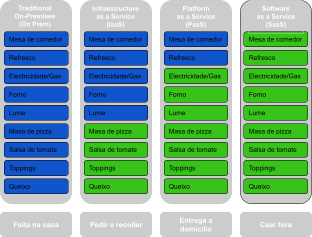
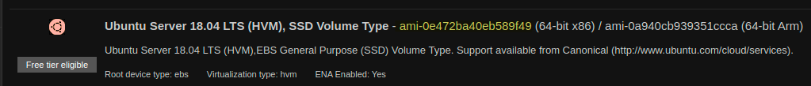

# Módulo 1: Primeiros pasos, configuración e instalación
Nesta tarefa imos a preparar o noso sistema antes de empezar ca nosa infraestrutura

tura cloud, todo isto dende cero con [AWS](https://aws.amazon.com/) e [Terraform](https://www.terraform.io/).

Para poder traballar co provider [AWS](https://aws.amazon.com/) precisamos da creación dunha conta na que faremos uso de [free tier](https://aws.amazon.com/free) do que dispoñemos no Basic plan.
Con este [free tier](https://aws.amazon.com/free) temos un ano de uso completamente gratuito nos servicios especificados sempre con certas limitacións.

O Basic plan é máis que suficiente para as prácticas e proxectos que vaiamos a deseñar neste curso.
### 1. Instalación Terraform

Para a instalación de [Terraform](https://www.terraform.io/) podemos acceder á páxina de [descargas](https://www.terraform.io/downloads) e ahí temos tódalas opcións dos diferentes SOs. Aquí mostraremos un exemplo de cada un dos sistemas máis empregados

#### 1.1 Windows
1. Para Windows dispoñemos dun executable o cal extraemos trala descarga nun directorio da nosa elección (por exemplo, c:\terraform).
2. Actualizamos a path do noso executable na path global do sistema:

`Control Panel` -> `System` -> `System settings` -> `Environment Variables` -> `PATH`

3. Abrimos unha nova terminal para que tome efecto o cambio
4. Verificamos a configuración da variable global co comando de terraform:
```shell
terraform -version
```
#### 1.2 macOS
Co package manager [brew](https://brew.sh/) podemos realizar a instalación en macOS con dos simples comandos:
```bash
brew tap hashicorp/tap
brew install hashicorp/tap/terraform
```
#### 1.3 Ubuntu/Debian
Ó igual que en macOS temos o package manager [brew](https://brew.sh/) para instalar de manera idéntica:
```bash
brew tap hashicorp/tap
brew install hashicorp/tap/terraform
```
Ou temos entre outras a opción mediante [curl](https://curl.se/) e a utilidade [apt](https://linuxize.com/post/how-to-use-apt-command/):
```bash
curl -fsSL https://apt.releases.hashicorp.com/gpg | sudo apt-key add -
sudo apt-add-repository "deb [arch=amd64] https://apt.releases.hashicorp.com $(lsb_release -cs) main"
sudo apt-get update && sudo apt-get install terraform
```
#### 1.4 VSCode extension (opcional)
[Visual Studio Code](https://code.visualstudio.com/) é un poderoso editor de texto que nos permite traballar dunha maneira moi cómoda e áxil debido á súa versatilidade, facilidade e cantidade de plugins, e que se integra dunha maneira moi sinxela con [Terraform](https://www.terraform.io/).

Para instalar a extensión de [Terraform](https://www.terraform.io/) en [Visual Studio Code](https://code.visualstudio.com/) e tan sinxelo como ir ó apartado das extensións, escribimos `terraform` no recadro de búsqueda e instalamos a extensión propia de [HashiCorp](https://www.hashicorp.com/), empresa de [Terraform](https://www.terraform.io/).

Podemos facer uso de calquer outro editor de texto de preferencia para a realización das actividades, pero debido á facilidade de uso e integración coas ferramentas que imos a usar recomendamos [Visual Studio Code](https://code.visualstudio.com/).

### 2. Creación da conta en AWS

Para a creación da nosa conta accedemos a [aws.amazon.com](https://aws.amazon.com) e vamos a crear a nosa conta AWS, premendo no botón da esquina superior dereita.


Requisitos:
- Conta de correo
- Número de teléfono
- Tarxeta de débito crédito

> ⚠️ Aínda que o Basic plan de [AWS](https://aws.amazon.com/) ten custo cero sempre dentro dos [límites de uso](https://docs.aws.amazon.com/awsaccountbilling/latest/aboutv2/free-tier-limits.html), ó momento de crear a conta xérase un cargo de $1 USD/EUR no proceso de verificación o cal queda pendente. Nun prazo de 3 a 5 días ese cargo desaparece. Lembrar tamén de ir cerrando os recursos a medida que xa non os usemos.


Para esta actividade imos a seleccionar o tipo de conta **Personal** e iremos introducindo os nosos datos persoais, así como verificándonos mediante o noso teléfono de contacto.

Unha vez terminado logueamos como **ROOT user** e xa estaría listo.

### Evaluación

**Evidencias da adquisición dos desempeños**:
- Captura de pantalla da versión de Terraform instalada
- Captura de pantalla da conta en AWS creada

**Indicadores de logro**: 
- Correctamente instalado o Terraform.
- Correctametne creada a conta de AWS e logueado co perfil ROOT.

**Criterios de corrección**:
- 5 puntos se hai unha captura da pantalla coa saída da versión de Terraform.
- 5 puntos se hai unha captura da pantalla coa conta de AWS correctamente creada.

**Autoavaliación**: Revisa e autoavalia o teu traballo aplicando os indicadores de logro.

**Peso na cualificación**:
- Peso desta tarefa na cualificación final ........................................ 10 puntos
- Peso desta tarefa no seu tema ....................................................... 10 %
---
# Módulo 2: Creando os nosos primeriros recursos
Terraform está escrito nunha linguaxe chamada **Hashicorp configuration language** e toda a nosa configuración de Terraform vaise atopar en ficheiros con extensión **.tf** onde traballaremos.

Para comenzar crearemos a nosa carpeta de traballo e o noso ficheriro de [Terraform](https://www.terraform.io/) **main.tf**, no que definiremos a configuración.

Como primeiro paso definiremos o noso [provider](https://registry.terraform.io/browse/providers), que é o plugin que permites ós users controlar unha [API](https://en.wikipedia.org/wiki/API) externa a cal é a responsable de comprender as interaccións coa propia API e expoñer os nosos recursos.



**Esquema comparativo** *- Servizos coma pizzas*

De maneira xeral os nosos providers son [Saas](https://www.redhat.com/en/topics/cloud-computing/iaas-vs-paas-vs-saas#saas) (Terraform Cloud, DNSimple, Cloudfare), [PaaS](https://www.redhat.com/en/topics/cloud-computing/iaas-vs-paas-vs-saas#paas) (Heroku) ou [IaaS](https://www.redhat.com/en/topics/cloud-computing/iaas-vs-paas-vs-saas#iaas) (Alibaba Cloud, OpenStack, Microsoft Azure, AWS), que é o caso que nos ocupa nesta práctica.

Temos toda a información referida ós providers na propia páxina de [providers de Terraform](https://registry.terraform.io/browse/providers).

Durante toda a actividade vamos a estar facendo referencia ás **documentacións oficiais** e iremos traballando por bloques, facendo uso das configuración exemplo que a propia docu nos ofrece. Ésta é unha maneira moi áxil, cómoda e eficaz de traballar, xa que nos libra de redactar de máis, nos facilita a tarefa da definición dos diferentes recursos e eliminanos gran parte dos erros de sintaxe.

### 1. Definindo a versión e o provider
No noso caso o noso provider vai a ser AWS e traballaermos ca conta creada previamente, polo que vamos á paxina de [providers de Terraform](https://registry.terraform.io/browse/providers), entramos en [AWS](https://registry.terraform.io/providers/hashicorp/aws/latest), e no apartado de [Documentation](https://registry.terraform.io/providers/hashicorp/aws/latest/docs) buscamos a configuración de noso provider, que neste caso sería a seguinte:
```terraform
terraform {
  required_providers {
    aws = {
      source  = "hashicorp/aws"
      version = "5.48.0"
    }
  }
}
```
Aquí vemos que definimos o noso encabezado con provider requerido e a versión. Neste provider definimos a [region](https://aws.amazon.com/about-aws/global-infrastructure/regions_az/#Regions) (rexións) que son as diferentes zonas físicas na que o noso provider clusteriza os seus datacenter.

> ⚠️ O óptimo e fixarse nos custos e locallización á hora de escoller unha rexión para traballar, xa que estas mesmas varían unhas das outras. Para a nosa actividade escolleremos **us-east-1** para homoxeneizar tódolos pasos. Deixo aquí unha interesante e breve análise de cálculo de custos na páxina [openupthecloud](https://openupthecloud.com/which-aws-region-cheapest/) entre as diferentes rexións e os principais servizos.

### 2. Asignando as nosas credenciais
No seguinte paso iremos a configurar a autenticación mediante [access keys](https://docs.aws.amazon.com/IAM/latest/UserGuide/id_credentials_access-keys.html): As access keys son credenciais de acceso para users IAM ou root. Podemos usalas para identificarnos sen user/pass e xerar acceso os servizos AWS e APIs, como cando usamos o AWS CLI.

Polo momento [hardcodearemos](https://en.wikipedia.org/wiki/Hard_coding) as nosas keys para centrarnos nos aspectos máis básico. Este é un proceso delicado que trataremos máis adiante co sea propio apartado.

```terraform
# Definimos o noso provider AWS cas credenciais
provider "aws" {
  region = "us-east-1"
  access_key = "access_key_ID"
  secret_key = "secret_access_key"
}} 
```
Para conseguir as nosas [credenciais](https://docs.aws.amazon.com/IAM/latest/UserGuide/id_credentials_access-keys.html) teremos que crealas en primer lugar, polo que imos a:

`AWS` -> `nome_usuario` -> `Security Credentials` -> `Access keys (access key ID and secret access key)` -> `Create New Access Key`

Facemos click e creamos a nosa **access key** co seu **secret** que empregaríamos na definición do noso provider para poder conectar. Temos a opción de descargar as nosas keys en formato [CSV](https://en.wikipedia.org/wiki/Comma-separated_values) o cal nos facilita a tarefa para telas dispoñibles.

> ⚠️ **IMPORTANTE:** A práctica de [hardcodear](https://en.wikipedia.org/wiki/Hard_coding) as keys de acceso considérase moi perigosa e insegura, pois expoñemos as nosas credencias creando un risco moi importante na noso código. Máis adiante daremos correción a este problema máis en profundidade. Compre recordar tamén que as credenciais de acceso creadas temos que gardalas sempre nun lugar de difícil acceso e a bo recaudo. No momento de crealas **SÓ AS PODEREMOS VER UNHA VEZ**, debemos ser moi cautelosos neste aspecto.

### 3. O noso primer recurso, a instancia
Unha das enormes vantaxes en Terraform e que a estructura non varía independetemente do provider, o que nos evita ter que aprender diferentes configuracións.

#### 3.1. Creando a instancia
A continuación imos a deploiar unha [instancia EC2](https://aws.amazon.com/ec2/features/) que non é máis que un servidor virtual na nube de Amazon. Amazon ofrece [diferentes opcións](https://aws.amazon.com/ec2/instance-types/) customizables en canto a recursos e potencia. Para o noso caso procederemos co recurso EC2 dispoñible de maneira gratuita no noso [free tier](https://aws.amazon.com/free).

Para saber como proceder volvemos á [documentación](https://registry.terraform.io/providers/hashicorp/aws/latest/docs/resources), e no apartado de recursos introducimos no buscador o recurso que buscamos, neste caso unha instancia en aws -> *aws_instance*

```terraform
# Creamos a nosa instancia EC2 de tipo t2.micro
resource "aws_instance" "meu_servidor" {
  ami           = "ami-0e472ba40eb589f49"
  instance_type = "t2.micro"
}
```
Os [AMI](https://docs.aws.amazon.com/AWSEC2/latest/UserGuide/AMIs.html) son as imaxes que provee AWS para lanzar as instancias e temos de Ubuntu, de Windows, de Red Hat ,de Fedora... Podemos comprobar as AMI gratuitas, dentro do dashboard de AWS, e no apartado de EC2, temos un botón na esquina superior esquerda para lanzar instancias **Launch Instances**. Se prememos nel desplégase unha lista de AMI dispoñibles coa súa ID e se son elixibles para o [free tier](https://aws.amazon.com/free). No momento compre revisar a AMI e non usar a que sale arriba especificada, xa que poden ir cambiando.

No noso caso escollemos a AMI de Ubuntu Server 18.04 LTS, no cal vemos a id da AMI que indicamos arriba e de tipo **t2.micro** a cal nos permite 750h de uso cada mes durante o primer ano ó rexistrarnos con AWS.



#### 3.2. Iniciando terraform
Para lanzar esta instancia teremos que acceder á consola de comandos ou na propia terminal de VSCode, e situándonos na carpeta do noso proxecto lanzar un:

```terraform
# Iniciamos o terraform na nosa carpeta proxecto
terraform init
```
Se  temos todo correcto sairanos unha mensaxe por terfimal:

`Terraform has been successfully initialized`

#### 3.3. Creando a nosa instancia
A continuación se queremos ver os nosos cambios e ver que todo está actulizado sen aplicar directamente podemos facer:

```terraform
# Lemos o noso estado actual, comparamos e propónsenos os cambios a realizar
terraform plan
```

Móstranos todos os cambios con códigos de color según as accións a tomar:

- <span style="color:green">+</span> create -> obxetos a crear
- <span style="color:red">-</span> destroy -> obxetos a borrar
- <span style="color:orange">~</span> update -> obxetos a modificar

Unha vez conforme podemos lanzar o apply para confirmar os cambios

```terraform
# Confirmamos/denegamos os cambios á reposta de value: yes/no
terraform apply
```

Co apply complete podemos ir ó nosos dashboard, facemos click en actualizar na esquina superior dereita e teremos a nosa instancia funcionando coa configuración feita.


Aquí podemos ver todos os datos da nosa instancia, dende o estado actual, o tipo `t2.micro` que especificamos, a AMI de Ubuntu correndo. Con só isto teremos deploiada a nosa primeira instancia en AWS usando Terraform.

Importante ter en conta que si facemos un segundo `terraform apply` **NON** iremos a deploiar unha segunda instancia, xa que traballamos cunha [linguaxe declarativa](https://codeburst.io/declarative-vs-imperative-programming-a8a7c93d9ad2).

No canto de volver a executar todo o código, Terraform analiza a configuración e compara co estado actual para ver se temos algún cambio ou modificación, e con eso en base trata de cumprir a nosa declaración. O realmente importante e que nós declaramos un estao final desexado e Terraform encárgase de cumplilo sempre que sexa posible.

#### 3.4. Destruindo a nosa instancia
Para destruir a nosa instancia creado vamos a facer uso do comando `destroy`:
```terraform
# Eliminamos a nosa instancia
terraform destroy
```
Previo a eliminación da nosa instancia, ó igual que co resto de comandos móstrasenos unha pantalla cos cambios a acomenter e pídesenos unha confirmación previa á destruir. Ésta información é moi útil xa que nos permite ter un vistazo rápido e directo de todas as modificacións.

> ⚠️ Por defecto `terraform destroy` destrúe toda a nosa infraestrutura

tura e non é unha técnica que vaiamos a utilizar frecuentemente, senón que é máis usual ir facendo `terraform apply` e ir modificando a nosa infraestrutura

tura.

A técnica máis usual para borrar artefactos é borrando no noso ficheiro Terraform o recurso e realizando un `terraform apply`.

### Evaluación

**Evidencias da adquisición dos desempeños**:
- Ficheiro de Terraform coas nosas credencias borradas / pixeladas
- Captura de pantalla do noso dashboard de AWS coa instancia executándose
- Captura de pantalla do noso dashboard de AWS coa instancia terminada

**Indicadores de logro**: 
- Conectamos correctamente co noso provider de AWS
- Ficheiro de Terraform lanzado correctamente e en execución sen erros.
- Borrado da instancia en AWS mediante un `terraform destroy`

**Criterios de corrección**:
- 5 puntos se hai unha captura da pantalla ou o código do ficheirto Terraform correctamente estructurado e funcional
- 5 puntos se hai unha captura da pantalla coa instancia funcionando correctamente no dashboard de AWS.
- 5 puntos se hai unha captura da pantalla coa instancia finalizada dende a terminal con `terraform destroy`

**Autoavaliación**: Revisa e autoavalia o teu traballo aplicando os indicadores de logro.

**Peso na cualificación**:
- Peso desta tarefa na cualificación final ........................................ 25 puntos
- Peso desta tarefa no seu tema ....................................................... 25 %
---
