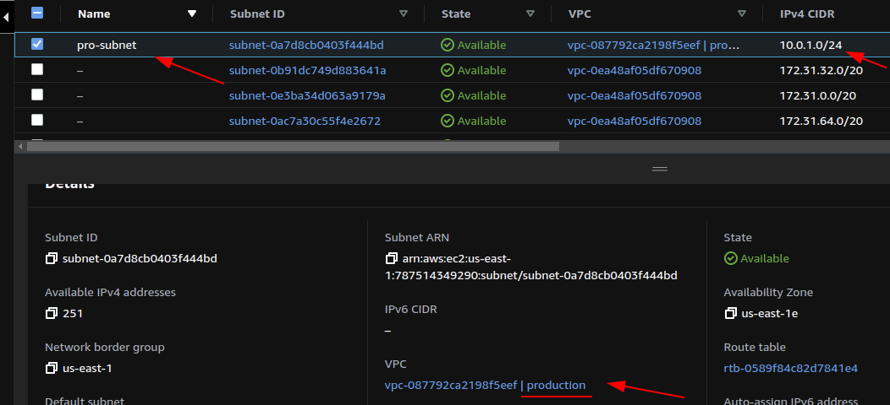
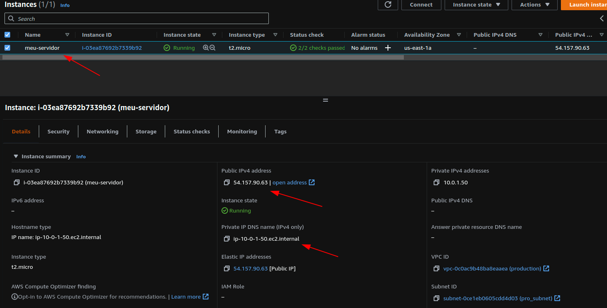
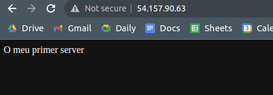

# Módulo 3: Referenciando recursos
Continuaremos co noso proxecto levantando máis recursos e referenciando para saber como comunicarnos entre os mesmos.

Como estivemos a ver, todo o que podemos facer ca consola de AWS podémolo facer con Terraform, así que tomaremos vantaxe disto e seguiremos creando máis recursos dende o noso Terraform.

### 1. O VPC
> O primeiro que imos a crear é a VPC por levar unha orde lóxica, pero cabe ter en conta que Terraform non sigue unha orde secuencial no momento de ir lendo o código, polo que nos resulta indiferente a orde na que vaiamos colocando os diferentes bloques de elemntos. Iso non quita de que resulta de suma importancia ter unha estructura clara á hora de traballar.

As sigras [VPC](https://aws.amazon.com/vpc/) veñen de Virtual Private Cloud, que ven sendo unha red privada e illada no noso entorno de AWS. Podemos crear cantas desexemos e estarán illadas unhas das outras en todo momento. Para crear unha VPC como sempre volvemos a facer uso da [documentación](https://registry.terraform.io/providers/hashicorp/aws/latest/docs) e buscamos o recurso de [aws_vpc](https://registry.terraform.io/providers/hashicorp/aws/latest/docs/resources/vpc).

A configuración e moi sinxela xa que só precisamos definir o cidr_block que é o rango de direccións IP da nosa VPC e podemos darlle un nome ó noso recurso. Podemos inclusive engadirlle unha `tag` para referenciar o recurso no noso AWS, o cal se define con `Name`:

```terraform
# Creamos a nosa VPC
resource "aws_vpc" "primeira_vpc" {
  cidr_block = "10.0.0.0/16"
  tags = {
    Name: "production"
  }
}
```
### 2. A subnet
A continuación iremos a crear unha subnet dentro da nosa VPC que acabamos de crear para segmentar a nosa rede. Igual que nos pasos anteriores na [documentación da subnet](https://registry.terraform.io/providers/hashicorp/aws/latest/docs/resources/subnet) especifícase todo de maneira moi sinxela.

```terraform
# Creamos a nosa subnet dentro da VPC
resource "aws_subnet" "primeira_subnet" {
  vpc_id     = aws_vpc.primeira_vpc.id
  cidr_block = "10.0.1.0/24"

  tags = {
    Name = "pro-subnet"
  }
}
```
Aquí temos varias cousas a destacar:
- Engadimos un nome ó noso recurso,
- O `cidr_block` está dentro do rango de direccións especificado na VPC que queremos usar.
- Referenciamos a VPC mediante `vpc_id`.
- Engadimos unha `tag` para diferenciar a nosa subnet.

Aquí vemos unha cousa moi interesante, que Terraform nos permite referenciar recursos dentro do mesmo ficheiro dunha maneira moi rápida. Neste caso referenciamos a nosa VPC indicando o tipo de recurso, o nome de recurso e a propiedade de éste que nos piden todo separado por puntos. Como vemos no exemplo de arriba quedaríanos tal que así:
```terraform
vpc_id = aws_vpc.primeira_vpc.id
```
Agora só faltaría realizar un `terraform apply` e lanzaríamos a nosa nova configuración. Se todo está correcto, dentro da consola de AWS no noso apartado de VPC poderíamos ver como temos a nosa VPC funcionando, co `cidr_block` e o `Name` que especificamos:


Do mismo xeito se imos ó apartado de subnets na nosa consola de AWS poderíamos ver a nosa subnet:



Vemos como a nosa subnet apunta á nosa VPC que nomeamos `production`, e que ten correctamente asignado un nome e o bloque de dirección.

> ⚠️ Se o entrar vemos máis dunha VPC e unha subnet non nos debemos preocupar, xa que AWS créanos unha VPC cunha serie de subnets por defecto que imos a obviar. 


### Evaluación

**Evidencias da adquisición dos desempeños**:
- Captura de pantalla da VPC.
- Captura de pantalla da subnet dentro da VPC creada.

**Indicadores de logro**: 
- Creado correctamente os recursos.
- Uso de TAGS e referencias para enlazar recursos.

**Criterios de corrección**:
- 5 puntos se hai unha captura da pantalla ca VPC na consola de AWS.
- 5 puntos se hai unha captura da pantalla ca subnet apuntando á VPC na consola de AWS.
**Autoavaliación**: Revisa e autoavalia o teu traballo aplicando os indicadores de logro.

**Peso na cualificación**:
- Peso desta tarefa na cualificación final ........................................ 10 puntos
- Peso desta tarefa no seu tema ....................................................... 10 %
---

# Módulo 4: Ficheiros de Terraform
Mentres estivemos na práctica destes exercicios tal vez percatámonos nuns ficheiros que se foron creando e que resultan fundamentais saber que son e que fan no noso traballo con Terraform. Imos cun anaco de teoría:

### 1. Directorio Terraform

No noso primer comando `terraform init` puidemos comprobar como se crearon unha serie de ficheiros e un directorio. Este directorio créase cando creamos novos plugins, por iso no momento de lanzar o `terraform init` para iniciar o noso Terraform, éste automáticamente xenera este directorio e vai instalar os plugins necesarios para que o noso código poida correr.

Como só temos un provider, todo o noso código será instalado na mesma carpeta. Poderíamos incluso borrar a nosa carpeta como demostración, e lanzando de novo o `terraform init` volveríase crear automáticamente con plugins necesarios.

### 2. O ficheiro terraform.tfstate

O ficheiro [terraform.tfstate](https://www.terraform.io/language/state) representa o noso estado de terraform. Almacena o estado da nosa infraestrutura e configuración e serve para ter constancia e comprobar o noso estado actual para poder comparalo co noso código.

O ficheiro está en formato [JSON](https://www.json.org/json-en.html), e aínda que podemos editar nel non é recomendable, pois aconséllase traballar usando o CLI.

Se accedemos podemos ver toda a nosa configuración creada, que neste caso sería a definición do noso provider, a VP e a subnet.

Este ficheiro é o **recurso principal** de Terraform para administrar o noso código e no caso de problemas ou incoherencias será a nosa fonte principal de credibilidade para recrear a nosa infraestrutura.


### 3. O ficheiro terraform.tfstate.backup

Como o seu propio nome indica almacénanos un backup do noso ficheiro de estado en caso de que o noso tfstate pérdase ou esté corrupto.

### 4. O ficheiro terraform.tfvars

O tfvars é o ficheiro de [variables de entrada](https://www.terraform.io/language/values/variables) o cal nos permite customizar diferentes aspectos dos nosos módulos de terraform sen necesidade de alterar o código orixe. Esto danos moitísima versatilidade á hora de traballar con diferentes configuracións, facendo así o noso código máis limpo, modular e reutilizable.

---

# Módulo 5: Metendo as mans na masa

Neste módulo crearemos todo o que vimos ata agora:
- Definimos o provider
- Engadiremos a nosa VPC
- Creamos un Internet Gateway
- Creamos unha Route Table
- Asociamos a nosa subnet ca Route Table
- Creamos un Security Group para permitir os portos 22 (SSH), 80 (HTTP) e 443 (HTTPS)
- Creamos unha interfaz de rede cunha IP na subnet creada previamente
- Asignamos un Elastic IP á interfaz de rede
- Creamos o par de chaves de acceso
- Creamos o noso Ubuntu server e instalamos/habilitamos apache2

### 1. Creando a instancia EC2

A provider o imos aproveitar da práctica guiada anterior:

```terraform
# Definimos o noso provider AWS cas credenciais
provider "aws" {
  region = "us-east-1"
  access_key = "access_key_ID"
  secret_key = "secret_access_key"
}
```
Se non recordamos o procedemento sempre podemos [voltar para revisar a documentación](05_practica_guiada.md#2.-Asignando-as-nosas-credenciais).

### 2. Engadimos a VPC

Do mesmo xeito aproveitamos a práctica do [Módulo 3](#1.-O-VPC):

```terraform
# Creamos a nosa VPC
resource "aws_vpc" "primeira_vpc" {
  cidr_block = "10.0.0.0/16"
  tags = {
    Name: "production"
  }
}
```
### 3. Creamos un Internet Gateway

A [Internet Gateway](https://docs.aws.amazon.com/vpc/latest/userguide/VPC_Internet_Gateway.html) permítenos conectar a nosa VPC e internet,  serve dous propósitos básicos:
- Proveer dun obxetivo na nos Route Table da VPC para o tráfico direccionable de internet.
- Realizar a conversión NAT para as instancias que teñan asignadas direccións IPv4 públicas.

Voltamos á [documentación](https://registry.terraform.io/providers/hashicorp/aws/latest/docs/resources/internet_gateway):

```terraform
# Creamos a internet gateway
resource "aws_internet_gateway" "gw" {
  vpc_id = aws_vpc.primeira_vpc.id
}
```
En `vpc_id = aws_vpc.primeira_vpc.id` indicamos referenciando á id do noso recurso VPC. 


Polo momento imos prescindir da TAG pois non é necesario para esta actividade.

### 4. Creamos a Route Table

En AWS cada subnet debe estar asociada cunha Route Table, que especifica as rutas permitidas para o tráfico saínte da subred. Sacamos a configuración da [documentación](https://registry.terraform.io/providers/hashicorp/aws/latest/docs/resources/route_table):

```terraform
# Creamos a Route Table
resource "aws_route_table" "pro_route_table" {
  vpc_id = aws_vpc.primeira_vpc.id

  route {
    cidr_block = "0.0.0.0/0"
    gateway_id = aws_internet_gateway.gw.id
  }

  route {
    ipv6_cidr_block = "::/0"
    gateway_id      = aws_internet_gateway.gw.id
  }

  tags = {
    Name = "pro"
  }
}
```
Cousas a ter en conta:
- Referenciamos o `vpc_id = aws_vpc.primeira_vpc.id`.
- Modificamos o `cidr_block = "0.0.0.0/0"` para que por defecto ruteé todo o tráfico de IPv4.
- Referenciamos o `gateway_id = aws_internet_gateway.gw.id`.
- En IPv6 o `cidr_block` xa está provisionado por defecto.
- Punteamos `egress_only_gateway_id = aws_internet_gateway.gw.id` coa mesma gateway.

### 5. Creamos a nosa subnet

Podemos coller de exemplo a subnet creada no [Módulo 3](#2.-A-subnet) e a adaptamos:

```terraform
# Creamos a nosa subnet dentro da VPC
resource "aws_subnet" "primeira_subnet" {
  vpc_id     = aws_vpc.primeira_vpc.id
  cidr_block = "10.0.1.0/24"
  availability_zone = "us-east-1a"

  tags = {
    Name = "pro_subnet"
  }
}
```

Agregamos a `availability_zone = "us-east-1a"` para ter unificados todos os puntos á hora de realización das tarefas.

#### 6. Asociamos a nosa subnet ca Route Table

Para asocuar a nosa subnet ca Route Table en AWS temos outro recurso denominado [aws_route_table_association
](https://registry.terraform.io/providers/hashicorp/aws/latest/docs/resources/route_table_association) que imos a empregar:

```terraform
# Asociamos a subnet ca Route Table
resource "aws_route_table_association" "a" {
  subnet_id      = aws_subnet.primeira_subnet.id
  route_table_id = aws_route_table.pro_route_table.id
}
```
Non imos referenciar este recurso polo que deixamos o nome `a` tal como está, e referenciamos tanto a `subnet_id = aws_subnet.primeira_subnet.id` como a `route_table_id = aws_route_table.pro_route_table.id`.

### 7. Creamos un Security Group para permitir os portos 22 (SSH), 80 (HTTP) e 443 (HTTPS)

Un security group funciona como un firewall virtual para instancias EC2 para controlar o tráfico entrante e saínte. Actúa no ámbito da instancia non na subnet. Vamos a facer uso da [documentación](https://registry.terraform.io/providers/hashicorp/aws/latest/docs/resources/security_group):

```terraform
# Configuración do security group
resource "aws_security_group" "permitir_web" {
  name        = "permitir_trafico_web"
  description = "Permitir trafico web entrante"
  vpc_id      = aws_vpc.primeira_vpc.id

  ingress {
    description      = "Trafico HTTPS"
    from_port        = 443
    to_port          = 443
    protocol         = "tcp"
    cidr_blocks      = ["0.0.0.0/0"]
    ipv6_cidr_blocks = ["::/0"]
  }

  ingress {
    description      = "Trafico HTTP"
    from_port        = 80
    to_port          = 80
    protocol         = "tcp"
    cidr_blocks      = ["0.0.0.0/0"]
    ipv6_cidr_blocks = ["::/0"]
  }

  ingress {
    description      = "Trafico SSH"
    from_port        = 22
    to_port          = 22
    protocol         = "tcp"
    cidr_blocks      = ["0.0.0.0/0"]
    ipv6_cidr_blocks = ["::/0"]
  }

  egress {
    from_port        = 0
    to_port          = 0
    protocol         = "-1"
    cidr_blocks      = ["0.0.0.0/0"]
    ipv6_cidr_blocks = ["::/0"]
  }

  tags = {
    Name = "permitir_web"
  }
}
```
Definimos os seguintes puntos:
- Asignameos nome, descripción e referenciamos a id da nosa VPC.
- Diferenciamos entre as regras de `ingress` (entrada) e `egress` (saída).
- Creamos unha regra para cada un dos casos que queremos:
  - Tráfico SSH para poder conectarnos por SSH mediante o porto 22.
  - Tráfico HTTP para poder conectanos por protocolo web mediante o porto 80.
  - Tráfico HTTPS para poder conectanos por protocolo web seguro mediante o porto 443.
- No `cidr_blocks` e `ipv6_cidr_blocks` damos acceso ás direccións que queremos, pero xa que estamos a crear un servidor web damos acceso a todos.
- En `from_port` e `to_port` podemos especificar un rango de portos se así precisamos.
- Permitimos tódolos portos no `egress`, calquer ip de saída nos`cidr_blocks` e `ipv6_cidr_blocks` e tódolos protocolos indicando `protocol = "-1"`.

> Resulta de suma importancia sempre ter moi ben definida as nosas regras de ingress para evitar erros na seguridade da nosa infraestrutura.

### 8. Creamos a interfaz de rede

A continuación crearemos unha interfaz de rede, que son esencialmente tarxetas de rede virtuais que podemos engadir ás nosas instancias EC2. Úsanse para habilitar a conexión de rede para as nosas instancias. Aquí temos a [documentación](https://registry.terraform.io/providers/hashicorp/aws/latest/docs/resources/network_interface):

```terraform
# Creamos  interfaz de rede
resource "aws_network_interface" "nic_servidor_web" {
  subnet_id       = aws_subnet.primeira_subnet.id
  private_ips     = ["10.0.1.50"]
  security_groups = [aws_security_group.permitir_web.id]
}
```
Creamos a nosa interfaz de rede e a vincualamos ca subnet anterior. Asignamos tamén unha lista de IPs das que temos dispoñibles dentro da nosa subnet e referenciamos o noso security group. Esto creános unha IP privada para o host que nos permita realizar tarefas como conexión por VPN ou SSH para administración por exemplo.

### 9. Asignamos unha Elastic IP

A Elastic IP é un recurso que nos xenera unha IP pública e que nos permite que calquer persona en internet poida acceder mediante esa dirección. Deixo aquí o [link a documentación](https://registry.terraform.io/providers/hashicorp/aws/latest/docs/resources/eip):

```terraform
# Asignamos a EIP
resource "aws_eip" "one" {
  vpc                       = true
  network_interface         = aws_network_interface.nic_servidor_web.id
  associate_with_private_ip = "10.0.1.50"
  depends_on                = [aws_internet_gateway.gw]
}
```

Nos valores deixamos `vpc = true` xa que o EIP está dentro dunha VPC, referenciamos a network_interface e asociamos cunha IP privada da lista que creamos na interfaz de rede (neste caso só creamos unha).

> Como comentamos antes, Terraform non precisa dunha orde concreta na declaración dos recursos xa que é o suficientemente intelixente para figurar como ir desplegando, **SALVO EXCEPCIÓNS**:
>
> Na [documentación](https://registry.terraform.io/providers/hashicorp/aws/latest/docs/resources/eip) indícase que o EIP require que o IGW sexa deploiado primeiro. Para solventar ese problema engadimos a flag `depends_on` e referenciamos unha lista co obxeto, neste caso o IGW.

### 11. Key pairs

Key pairs consta de un par de claves ( pública e privada ) que forman un conxunto de credenciais de seguridade, e que se utilizan para autenticarnos cando nos conectamos a unha instancia EC2 de AWS. EC2 almacena a clave pública na súa instancia e nos almacenamos a clave privada

> ⚠️ É de suma importancia ter almacenadas as nosas claves privadas nun lugar seguro.

Para a creación das claves accedemos á nosa `consola de AWS -> EC2 -> Network & Security -> Key Pairs`.

Unha vez dentro na esquina superior dereita prememos o botón de Create key pair:


> No momento de creación temos dos formatos distintos:
>
> - **.pem** para MacOs ou Linux ( [OpenSSH](https://www.openssh.com/) )
> - **.ppk** para usar con Windows ( [Putty](https://www.putty.org/) )

No momento da creación, váisenos descargar automáticamente. Esta clave vainos a permitir conectar co noso servidor cando o deploiemos.

### 12. Creamos o noso Ubuntu server e instalamos/habilitamos apache2

Para a creación do noso server vamos a reusar a nosa [instancia creada](05_practica_guiada.md#3.-O-noso-primer-recurso,-a-instancia) e engadimos as diferentes configuracións tal como nos ensina na [documentación](https://registry.terraform.io/providers/hashicorp/aws/latest/docs/resources/instance) e instalamos un servidor web ( [apache2] ):

```terraform
# Creamos a nosa instancia EC2 de tipo t2.micro
resource "aws_instance" "meu_servidor" {
  ami               = "ami-0e472ba40eb589f49"
  instance_type     = "t2.micro"
  availability_zone = "us-east-1a"
  key_name          = "main-key"
  
  network_interface {
    device_index = 0
    network_interface_id = aws_network_interface.nic_servidor_web.id
  }
  
  user_data = <<- EOF
              #!/bin/bash
              sudo apt update -y
              sudo apt install apache2 -y
              sudo systemctl start apache2
              sudo bash -c 'echo O meu primer server > /var/www/html/index.html'
              EOF
  tags = {
    Name = "meu-servidor"
  }
}
```
Declaramos os seguintes conceptos:
- A `availability_zone = "us-east-1a"` tal como definimos anteriormente
- A nosa key recén creada co nome que lle demos.
- O bloque da nosa interfaz de rede en `network_interface`:
  - O `device_index = 0` se refire á primeira interfaz de rede, xa que empezamos a contar de 0.
  - A id da nosa interfaz de rede.
- Para facer a nosa proba dun modo sinxelo vamos a facer uso dun pequeno script que pasaremos á flag `user_data` para que faga o despregue do noso apache2 e comprobar o funcionamento do mesmo.

Con isto xa quedaría facer un `terraform apply` e se todo está correcto estaría a inicializar a nosa instancia con tódolos recursos creados e cunha IP pública para acceder ó apache2.

### 13. Probas

Se accedemos á nosa consola de AWS podemos ver como temos unha instancia creada co nome e características que lle demos:



Se agora collemos a IP pública que nos otorga e a introducimos no buscador teremos a nosa web funcionando:



Agora imos a conectar por SSH e para iso na páxina da instancia temos un botón superior chamado **Connect** cas instrucións para conectarnos por SSH. No noso caso como user de Linux abrimos o noso cliente e usamos a key descargada previamente para conectarnos:


> Para Windows teríamos que facer uso do cliente [Putty](https://www.putty.org/)

### Evaluación

**Evidencias da adquisición dos desempeños**:
- Captura de pantalla da instancia correndo en AWS
- Captura de pantalla do server apache2 correndo en IP pública
- Captura de pantalla de acceso mediante SSH

**Indicadores de logro**: 
- Creado correctamente os recursos.
- Uso de TAGS e referencias para enlazar recursos.
- O security groups está correctamente definido.

**Criterios de corrección**:
- 5 puntos se hai unha captura da instancia na consola de AWS.
- 5 puntos se hai unha captura da pantalla do apache2 correndo no buscador.
- 5 puntos se hai acceso correcto mediante SSH

**Autoavaliación**: Revisa e autoavalia o teu traballo aplicando os indicadores de logro.

**Peso na cualificación**:
- Peso desta tarefa na cualificación final ........................................ 15 puntos
- Peso desta tarefa no seu tema ....................................................... 15 %
---