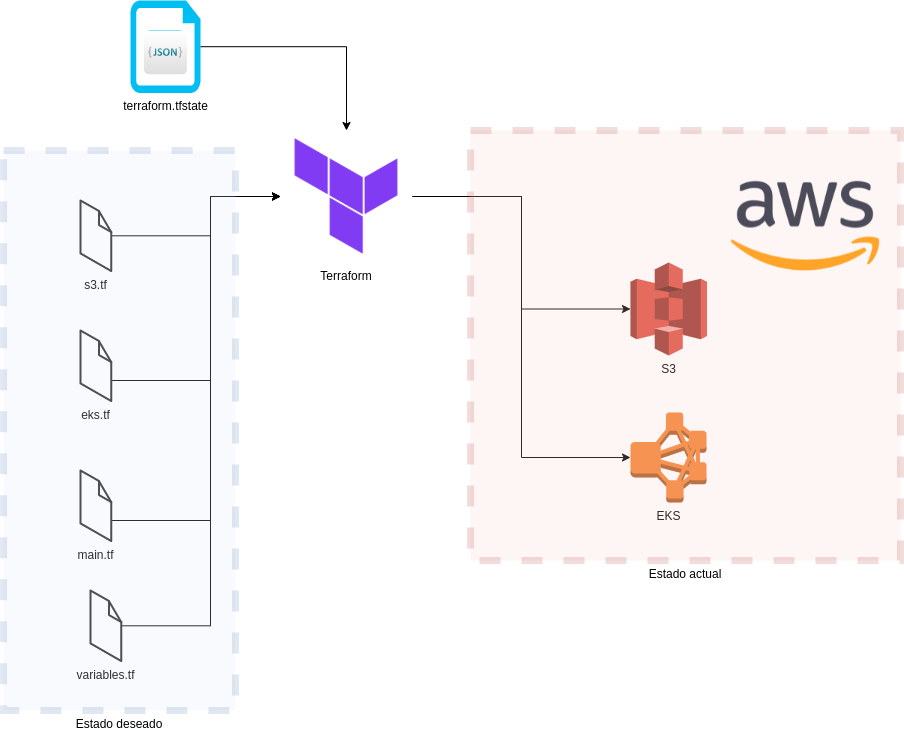
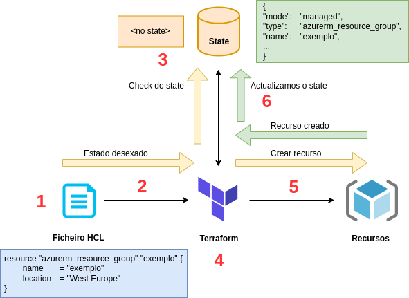
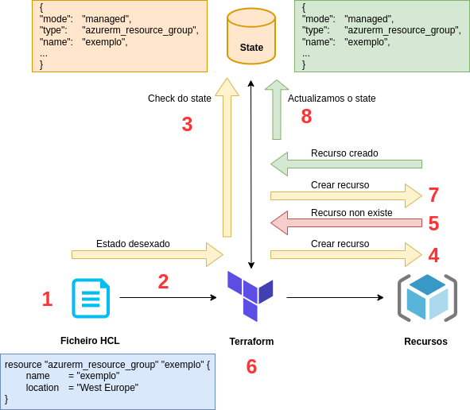

# Estados en terraform

El estado es la pieza que usamos en nuestro Terraform para asignar nuestros recursos "reales" a nuestra configuración, realizar un seguimiento de los metadatos y mejorar el rendimiento de nuestra infraestructura.

Terraform debe almacenar el estado de su infraestructura y configuración administradas. Este estado se utiliza para asignar recursos del mundo real y su configuración.

El estado se almacena de forma predeterminada en un archivo local llamado "terraform.tfstate", pero también se puede almacenar de forma remota, lo que es ideal en un entorno formado por varias personas.

Terraform utiliza este estado local para crear planes y realizar cambios en la infraestructura. Antes de cualquier operación, Terraform realiza una verificación para actualizar este estado con la infraestructura real.

Como podemos ver en este ejemplo, hemos declarado una serie de artefactos que pertenecen a la infraestructura provista por AWS (Amazon Web Services). En este caso tenemos un Amazon S3 (Amazon Simple Storage Service) que es un servicio de almacenamiento de objetos de este proveedor. Con Terraform podemos declarar que queremos esto en nuestra infraestructura. Lo mismo sucede con EKS (Elastic Kubernetes Service), que es otro servicio de Amazon, en este caso es un servicio para ejecutar y escalar Kubernetes en la nube.

Se puede ver que tenemos más archivos, como variables.tf y main.tf, que son específicos de terraform y que iremos analizando a medida que avancemos en el curso.

## Reconciliación de estados 🤝

Diríamos que el estado en Terraform es como una instantánea de nuestra infraestructura actual, que usamos para mantener y comparar todas las operaciones [CRUD](https://en.wikipedia.org/wiki/Create,_read,_update_and_delete) de nuestra infraestructura. Es nuestro primer punto de apoyo o inicio a la hora de trabajar con Terraform.

Tenemos que tener muy claro, que nuestro **"estado deseado"** no es lo mismo que nuestro **"estado actual"**. Nuestro estado deseado son las diversas configuraciones que vamos a definir para aplicar a nuestra infraestructura, mientras que el estado actual es nuestra configuración actual.

Terraform al momento de aplicar nuestro estado deseado seguirá los siguientes pasos:

1. Análisis de los [ficheros HCL](https://terraform-infraestructura.readthedocs.io/es/latest/sintaxis/) (HashiCorp Configuration Language).
2. Con la información de nuestros ficheros HCL, se crea un esquema de los recursos que queremos aprovisionar (**_estado deseado_**) y se resuelven las dependencias entre ellos para decidir un orden lógico en el que crearlos.
3. Inspeccionamos nuestro **estado actual** (si lo tenemos) para ver qué tenemos y qué no tenemos desplegados. Este es el **estado percibido** ya que no hay conexión entre lo que Terraform cree que existe y lo que realmente existe.
4. A continuación se realiza un análisis lógico entre nuestro **estado deseado** y nuestro **estado percibido**, para luego decidir qué acciones [CRUD](https://en.wikipedia.org/wiki/Create,_read,_update_and_delete) son necesarios y el orden de ellos para alinear nuestro **estado percibido** con nuestro **estado deseado**.
5. Ahora se toman las acciones necesarias para lograr nuestro **estado deseado**. Como resultado, nuestros recursos comenzarán a crearse y tendremos nuestro **estado deseado** como nuestro **estado actual**.
6. Terraform actualiza nuestro estado para reflejar los cambios realizados.

En este diagrama vemos que al crear un recurso Terraform primero debe verificar si el recurso existe en el estado, y posteriormente verificar con nuestro proveedor Cloud para asegurarse de que el estado actual coincida con lo que se espera encontrar.

> ⚠️ El conjunto de operaciones a realizar para alinear el estado deseado con el estado actual se conoce como **reconciliación**. Se dice que Terraform reconcilia el estado deseado con el estado actual.

## Estados no reconciliados

La pregunta ahora sería: ¿qué pasaría si con el tiempo alguien borra nuestro grupo de recursos declarados?, ¿qué pasaría si relanzamos nuestro Terraform?

Veamos los pasos que realizaría Terraform:

1. Análisis de archivos HCL.
2. Comprobamos que en nuestro **estado deseado** tendríamos ese grupo de recursos.
3. Comprobamos en nuestro estado si tenemos el grupo de recursos.
4. Terraform identifica que nuestro **estado percibido** tiene esa entrada, por lo que vamos a nuestro proveedor de nube para verificar el **estado actual**.
5. **Azure informa un 404**, lo que indica que no existe.
6. Terraform realiza un análisis y una alineación entre nuestro **estado deseado** y nuestro **estado actual** y determina las acciones necesarias para crear nuestro grupo de recursos.
7. Terraform toma las acciones necesarias para crear nuestro grupo de recursos.
8. Terraform actualiza nuestro estado para reflejar los cambios realizados.

En este diagrama vemos cómo el estado cambia la forma en que funciona Terraform. Cuando verificamos nuestro estado con el proveedor, vemos que nuestro grupo de recursos está eliminado, por lo que debemos volver a crearlo.

Esto no quiere decir que ante un cambio de recursos Terraform vaya a crear el recurso borrado o modificado, por ejemplo, en el caso de cambiar el nombre del recurso, Terraform realizaría una actualización para reconciliar nuestro estado.

> ⚠️ **IMPORTANTE:** El estado puede jugar en nuestra contra si no trabajamos con él como corresponde. Lo ideal siempre sería gestionar la administración de nuestros recursos siempre desde un único punto, Terraform en nuestro caso. Si hacemos uso de diferentes canales de administración, como el portal de nuestro proveedor web, generaremos un desajuste entre nuestro estado y la situación real de la infraestructura.
